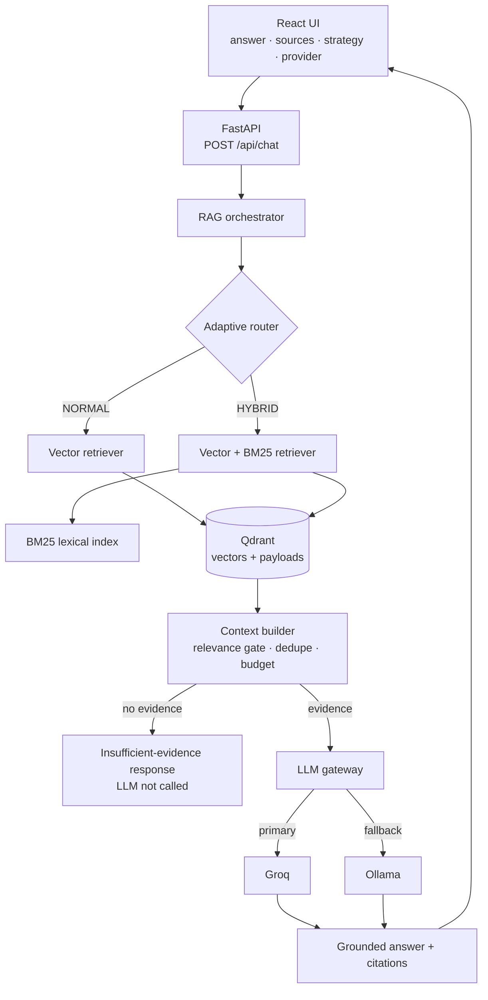

# Adaptive University RAG Assistant

> **Status: Phase 8 — complete.** A practical, explainable retrieval-augmented
> generation (RAG) system that answers university students' questions from
> official academic documents, with adaptive retrieval, grounded answers,
> citations, and LLM provider fallback (Groq → Ollama).

## Project

**Adaptive University RAG Assistant** — students ask questions about academic
policies, regulations and course syllabi; the system retrieves the relevant
evidence, answers **only** from that evidence, and cites the source of every
claim. When the documents do not contain the answer, it says so instead of
inventing one.

## Problem

Students need fast, trustworthy answers about rules that materially affect them
(attendance, exam eligibility, fees, library loans). A plain language model is
the wrong tool on its own: it confidently paraphrases or invents policy details,
which is unacceptable for academic regulations. The university's authoritative
answers live in a small set of official PDFs, so the right approach is to
**ground every answer in those documents**.

## Solution

A retrieval-augmented generation (RAG) pipeline with six steps:

1. **Ingest** — extract, clean, chunk and embed the PDFs into Qdrant (offline).
2. **Route** — a deterministic, explainable router picks NORMAL (vector) or
   HYBRID (vector + BM25) per query.
3. **Retrieve** — ranked evidence chunks from the selected strategy.
4. **Build context** — relevance gate, near-duplicate removal, size budget.
5. **Generate** — a grounded, cited answer via a provider-independent LLM layer
   (Groq primary → Ollama fallback).
6. **Cite / decline** — return the answer with citations, or the controlled
   "insufficient evidence" message when nothing relevant exists.

## Key features

- **Adaptive retrieval** — a deterministic, explainable router picks a retrieval
  strategy per query at no LLM cost.
- **Hybrid retrieval** — vector search + BM25 lexical matching fused with
  Reciprocal Rank Fusion, so course codes and exact policy terms are not blurred
  by embeddings.
- **Grounded answers only** — the model may cite only the evidence blocks it
  was given; invented citation markers are stripped.
- **Citations with source metadata** — every answer returns document + page.
- **Honest decline** — when nothing relevant is retrieved the LLM is not called
  at all; a controlled insufficient-evidence message is returned with no
  sources.
- **Provider fallback** — a provider-independent `LLMClient` protocol with Groq
  primary and a local Ollama fallback (`provider=ollama_fallback` on failover).
- **Failure handling** — typed errors mapped to generic HTTP responses; no stack
  traces, API keys or environment values reach the client.
- **Server-free local stack** — embeddings run in-process (fastembed) and Qdrant
  uses its embedded engine; no Docker or external server is required for the
  basic demo.
- **Reproducible demo** — a deterministic synthetic corpus and a manual
  evaluation suite (see the sections below).

---

## Architecture

The overview below is the whole system; the module-by-module path follows.



**Query path (online), module by module:**

```text
User
  ↓
React frontend  (answer + sources + strategy + provider)
  ↓
FastAPI  POST /api/chat
  ↓
RAG orchestrator            app/rag.py
  ↓
Query router                app/routing.py     NORMAL | HYBRID (explainable)
  ↓
Retrieval                   app/retriever.py   vector | vector + BM25 (RRF fusion)
  ↓
Qdrant                      app/vectorstore.py
  ↓
Context builder             app/context.py     relevance gate, dedupe, budget
  ↓
LLM gateway                 app/llm.py         Groq (primary) → Ollama (fallback)
  ↓
Grounded answer + citations + strategy metadata
```

**Ingestion path (offline):**

```text
data/documents/*.pdf
  ↓  app/ingestion.py    extract → clean → chunk → metadata
  ↓  app/embeddings.py   fastembed (local, ONNX)
  ↓  app/vectorstore.py  Qdrant (embedded engine)
Qdrant collection "university_docs"
```

The Qdrant payloads are the single source of truth for the corpus; the BM25
lexical index (`app/bm25.py`) is rebuilt from them, so there is no second
datastore.

## Why these engineering decisions

### Why RAG?

A model's parametric knowledge is a snapshot, can drift, and cannot cite a
specific regulation. Retrieval anchors the answer in the university's actual,
current documents and makes the answer **verifiable** — the source is shown to
the user. For rules and policies, verifiability matters more than fluency.

### Why hybrid retrieval (vector + BM25)?

Vector (semantic) search is great for paraphrase ("illness" → "medical leave")
but blurs exact tokens. Course codes (`CS201`, `ENCT 353`) and precise policy
terms ("re-evaluation", "75 percent") need **exact lexical matching**. Hybrid
combines both and fuses them with Reciprocal Rank Fusion (RRF), so the two
score scales never have to be directly comparable.

### Why adaptive routing?

Different queries need different evidence. A short conceptual question is best
served by pure semantic search; a question naming a course code or a precise
policy term also benefits from lexical matching. Routing selects the most
appropriate strategy per query instead of always paying for the hybrid path.

### Why deterministic routing?

A small set of cheap, readable rules (regex + terminology lists) classifies most
queries correctly without an LLM call — faster, cheaper, fully explainable, and
with no extra failure mode. The router also returns *why* it chose a strategy,
which the UI surfaces for every answer.

### Why Groq + Ollama?

Groq gives fast, high-quality hosted inference with a one-key setup. Ollama
gives a **local, offline fallback** for resilience and control (no data leaves
the machine, no per-token cost). A provider-independent `LLMClient` protocol
plus a fallback chain means the RAG layer only consumes the interface and never
knows which provider actually answered.

### Why Qdrant?

Qdrant is a purpose-built vector database that stores each embedding together
with its chunk metadata (text, document, page), so retrieval returns citable
sources directly. Its **embedded engine** runs in-process with no server or
Docker, which keeps local setup trivial.

## Engineering tradeoffs (intentionally not used)

The following were considered and deliberately **excluded**. None are "bad"
technologies — they simply are not justified by this project's requirements:

> The project uses the minimum architecture necessary to demonstrate adaptive
> RAG reliably within the available scope. Additional infrastructure would
> increase operational complexity without providing enough value for the
> current requirements.

| Technology | Why it was excluded |
| --- | --- |
| Neo4j / Graph RAG | The corpus is flat policy text, not a graph of entities; no relationship traversal is needed. |
| PostgreSQL | Qdrant already persists vectors + payloads; a second relational store would be redundant. |
| Redis | There is no caching/queue hot path; retrieval is a single round-trip per request. |
| Kubernetes / microservices | A single FastAPI process plus one React app is easier to run, debug and demo. |
| Complex agent frameworks | The pipeline is a fixed, transparent sequence; agents would add a failure surface with no benefit. |

The tradeoff: **less operational complexity + smaller scope + easier debugging +
a clearer AI pipeline**, in exchange for fewer scale-out options and fewer
features.

These technologies could become reasonable choices at larger scale or under
different requirements — for example a graph store once the corpus is a network
of related entities, PostgreSQL once transactional state must be stored
alongside vectors, Redis once caching or background work is a real hot path, or
Kubernetes/microservices once a single process is genuinely the bottleneck. At
the current scope, each would add operational cost without enough value.

## Implementation status

| Area | Status |
| --- | --- |
| Repository structure | Done |
| Backend app + `GET /health` | Done |
| Centralized environment configuration | Done |
| Backend tests | Done |
| Frontend app that starts | Done (connected chat UI) |
| PDF ingestion (extract/clean/chunk/metadata) | Done |
| Embedding interface + local provider | Done |
| Qdrant integration (upsert/search) | Done |
| Ingestion CLI | Done |
| Demo corpus | Done (synthetic, `scripts/generate_demo_corpus.py`) |
| Retrieval API endpoint | Done (`POST /api/chat`) |
| Vector retriever (query side) | Done |
| Context builder (threshold/dedupe/budget) | Done |
| LLM provider (Ollama) behind interface | Done |
| Grounding + citations | Done |
| Insufficient-evidence behavior | Done |
| Deterministic query router (NORMAL/HYBRID) | Done |
| Hybrid retrieval (vector + BM25, RRF fusion) | Done |
| Strategy + reason in API response | Done |
| Groq provider + fallback (LLM gateway) | Done |
| LLM error classification (config/timeout/unavailable/generation) | Done |
| Provider metadata (`groq` / `ollama` / `ollama_fallback`) | Done |
| Web search strategy (WEB) | Not started (optional/deferred) |
| OCR for scanned PDFs | Not started |
| Frontend ↔ backend integration | Done (React chat → `/api/chat` via Vite dev proxy; CORS configurable via `CORS_ALLOWED_ORIGINS`) |
| Docker packaging | Deferred (optional; embedded Qdrant keeps the local setup server-free) |

## Backend setup

Requires Python 3.11+ (developed on 3.13).

```bash
cd backend
python -m venv .venv
source .venv/Scripts/activate   # Windows (Git Bash); use .venv/bin/activate on Linux/macOS
pip install -r requirements.txt
```

Qdrant runs locally with **no server and no Docker**: the default
`QDRANT_URL=local` uses the Qdrant engine embedded in the Python process,
persisted to `data/qdrant_storage/`. Pointing `QDRANT_URL` at an
`http://...` address switches to a Qdrant server if you ever want one — no
code changes needed.

## Demo data

Generate the deterministic synthetic demo PDFs (university policies and a
course syllabus — no private or internet-sourced documents):

```bash
cd backend
python ../scripts/generate_demo_corpus.py
```

Then ingest them into Qdrant:

```bash
cd backend
python -m app.ingest --recreate
```

The CLI prints how many chunks were created, which embedding provider ran,
and how many vectors were stored. Re-running it is safe: chunk IDs are
deterministic, so re-ingestion overwrites instead of duplicating.

## Frontend setup

Requires Node.js 20+ (developed on Node 24).

```bash
cd frontend
npm install
```

## Environment configuration

Copy the example file and fill in real values:

```bash
cd backend
cp .env.example .env
```

`.env` is git-ignored and must never be committed. `.env.example` contains
placeholders only.

| Variable | Purpose | Used in Phase 2? |
| --- | --- | --- |
| `APP_ENV` | Runtime environment label | Yes (health response) |
| `API_HOST` / `API_PORT` | Where the API listens | Yes |
| `DOCUMENTS_DIR` | Where ingestion looks for PDFs | Yes |
| `CHUNK_SIZE` / `CHUNK_OVERLAP` | Character-based chunking | Yes |
| `EMBEDDING_PROVIDER` | `local` (fastembed) or `ollama` | Yes |
| `EMBEDDING_MODEL` / `EMBEDDING_DIM` | Local model and vector size | Yes |
| `OLLAMA_EMBEDDING_MODEL` | Model when provider is `ollama` | Optional |
| `QDRANT_URL` / `QDRANT_COLLECTION` | Vector store (`local` = embedded engine) | Yes |
| `LLM_PROVIDER` (`auto`/`groq`/`ollama`) / `LLM_TIMEOUT` / `LLM_TEMPERATURE` | Chat generation chain | Yes |
| `GROQ_API_KEY` / `GROQ_MODEL` / `GROQ_BASE_URL` | Primary hosted provider (Groq) | Yes (Phase 5) |
| `OLLAMA_BASE_URL` / `OLLAMA_MODEL` | Fallback local provider (Ollama) | Yes |
| `RETRIEVAL_TOP_K` / `MIN_RELEVANCE_SCORE` | Retrieval + evidence threshold | Yes |
| `MIN_BM25_SCORE` | HYBRID-only gate for lexical-only chunks | Yes (Phase 4) |
| `MAX_CONTEXT_CHARS` | Context budget | Yes |

## How to run

Backend (from `backend/`; needs a Groq API key for the hosted provider, and/or
Ollama running with `OLLAMA_MODEL` pulled as the local fallback):

```bash
uvicorn app.main:app --reload
```

Check it:

```bash
curl http://127.0.0.1:8000/health
# {"status":"ok","service":"Adaptive University RAG Assistant","environment":"development"}
```

Ask a grounded question (after ingesting the demo corpus):

```bash
curl -X POST http://127.0.0.1:8000/api/chat \
  -H "Content-Type: application/json" \
  -d '{"message": "What is the minimum attendance requirement?"}'
```

Example response:

```json
{
  "answer": "75 percent [1]",
  "sources": [{"document": "attendance_policy.pdf", "page": 1}, ...],
  "enough_evidence": true,
  "retrieval": {"chunks_retrieved": 5, "chunks_used": 5, "top_score": 0.72},
  "provider": "ollama",
  "model": "llama3.1",
  "strategy": "normal",
  "strategy_reason": "Short conceptual question with no exact identifiers that would need lexical matching."
}
```

Every response exposes the selected retrieval strategy and why it was chosen.
A question containing a course code, acronym, or exact policy term (e.g. "What
are the attendance requirements for ENCT 353?") is routed to `"hybrid"`; the
hybrid response additionally fuses BM25 hits into the evidence and keeps
lexical-only chunks only when their BM25 score reaches `MIN_BM25_SCORE`.

The `provider` field reports who generated the answer: `"groq"`,
`"ollama"`, or `"ollama_fallback"` (Groq failed and Ollama answered instead).
With `LLM_PROVIDER=auto` (the default) Groq is tried first and Ollama is the
fallback; if `GROQ_API_KEY` is missing, Groq is skipped entirely and Ollama is
used directly. Responses never expose API keys or provider-internal error
details.

If the corpus does not contain the answer, the endpoint returns the controlled
message "I couldn't find enough information about that in the provided
university materials. If you like, ask me about a topic covered in the
uploaded course materials." with empty sources — the LLM is not called at all.

Frontend (from `frontend/`):

```bash
npm run dev
```

Then open http://localhost:5173 (or add `-- --port 5174` if that port is
taken; the Vite config proxies `/api` and `/health` to FastAPI on port 8000,
so no second origin reaches the browser in development).

The UI shows, for every answer: the grounded answer with citations, the
sources exactly as returned by the backend (document + page), the selected
retrieval strategy (`NORMAL`/`HYBRID`) with the router's reason, and the
generating provider (`Groq`, `Ollama fallback`, `—` when no LLM ran). A
status line reflects a real `/health` check — never a static "connected"
badge — and request errors are shown inline instead of fake answers.

## Demo script (≈ 5 minutes)

A suggested walkthrough for an interview or a live demo. Prerequisite: the demo
corpus is ingested and both servers are running (see the sections above).

### Demo 1 — Normal retrieval

Ask: *"What is the minimum attendance requirement?"*

- The UI shows **NORMAL**. The router read a short conceptual question with no
  exact identifier and chose pure vector search.
- Explain: semantic search matches "minimum attendance requirement" to the
  attendance policy without needing exact wording.

### Demo 2 — Hybrid retrieval

Ask: *"What are the credit requirements for CS201?"*

- The UI shows **HYBRID**. The router detected the course code `CS201` and added
  BM25 lexical matching on top of vector search.
- Explain: course codes must match exactly, so lexical retrieval is worth the
  extra step.

### Demo 3 — Grounding & citations

Point at the **Sources** list for the CS201 answer.

- The answer carries `[n]` markers; the sources show the document + page.
- Explain grounding: the model was instructed to cite evidence blocks, and the
  pipeline strips any citation that does not point at a real block.

### Demo 4 — Unknown question (insufficient evidence)

Ask: *"Who won the football world cup?"* (or *"What is the tuition fee for the
master's program?"*) — a question the corpus cannot answer.

- The system returns the controlled message "I couldn't find enough
  information about that in the provided university materials..." with
  **no sources** — the LLM is not called at all.
- Explain: the relevance gate rejected everything, so the system declines rather
  than invent.

### Demo 5 — Provider fallback

Ask any question and note the **Provider** field (`Groq`, `Ollama fallback`, or
`—`).

- Explain the provider abstraction: `LLMClient` protocol → `FallbackLLMClient`
  tries Groq first, then Ollama. The RAG layer never knows which provider
  answered; failures are typed and mapped to generic client messages.
- To force a visible fallback, make Groq *unavailable* (not misconfigured):
  temporarily point `GROQ_BASE_URL` at an unreachable host — e.g.
  `GROQ_BASE_URL=http://127.0.0.1:9` — restart the backend, and ask again. The
  **Provider** field changes to `Ollama fallback` and the answer is still
  grounded. Restore the real URL afterwards.
- Note the deliberate distinction: an *availability* failure (unreachable, 429,
  5xx, timeout) falls back, while a *configuration* failure (401/403, missing
  key) does **not** — it surfaces as an error rather than being masked. Clearing
  `GROQ_API_KEY` is therefore not a fallback demo: with `LLM_PROVIDER=auto` an
  empty key skips Groq entirely and Ollama answers directly (`provider=ollama`).

### Demo 6 — Architecture

Walk through the diagram in the **Architecture** section: React → FastAPI →
router → retrieval → Qdrant → context → Groq/Ollama → cited answer, plus the
offline ingestion path.

## How to run tests

Backend tests run against the real FastAPI application via the test client:

```bash
cd backend
pytest
```

The suite uses deterministic fakes for external services; tests against the
real Qdrant engine always run (embedded, in-process), and a test against a
dedicated Qdrant *server* runs only when `QDRANT_URL` points at one. Tests
cover the deterministic router, the BM25 index, hybrid fusion (dedupe,
metadata, RRF ranking), the context gates (semantic and BM25 thresholds), the
RAG orchestrator (grounding, citations, insufficient evidence, strategy
dispatch) and the `/api/chat` endpoint.

> **Model note:** the default `OLLAMA_MODEL` is `llama3.1` (8B). Measured on
> the demo corpus, 3B-class models (e.g. `llama3.2`) degenerate to one-token
> answers with full-size contexts; 8B stays grounded and cited.

Frontend lint:

```bash
cd frontend
npm run lint
```

## Evaluation (manual, not a benchmark)

Phase 7 ships a small manual evaluation over the synthetic corpus — explicitly
**not** a scientific benchmark. The dataset (`backend/evaluation/dataset.json`)
has 18 questions spanning simple factual, semantic, exact terminology,
course-code, multi-concept, multi-source, no-answer and ambiguous categories,
each with an expected strategy, expected source and a decline expectation.

Run it (after ingesting the corpus; the embedded Qdrant engine takes an
exclusive lock, so stop the API server first):

```bash
cd backend
python ../scripts/run_evaluation.py --json evaluation/report.json
```

The runner executes the **real** pipeline (router → retrieval → context → LLM
chain) and measures routing correctness, retrieval relevance (top-1/top-3),
citation presence, evidence-gate behaviour, controlled declines and latency,
then prints a per-case pass/fail table plus a summary. The latest results and a
failure analysis are in `backend/evaluation/REPORT.md` (12/18 pass in the latest
run; the LLM-path cases vary slightly between runs).

Failure-mode coverage is asserted by the test suite (`tests/test_fallback.py`,
`tests/test_groq.py`, `tests/test_llm.py`, `tests/test_api_chat.py`,
`tests/test_health.py`): Groq / Ollama / both-providers unavailable, model
timeout, empty and whitespace queries, no relevant documents, malformed
requests, invalid configuration, and vector-store failure → 503. Client-facing
errors are generic messages — stack traces, API keys and environment values are
never exposed.

### RAGAS evaluation (retrieval + grounded generation quality)

A separate evaluation scores the **real** pipeline with official RAGAS metrics
over the 95-question dataset in `backend/evaluation/dataset.json` (78 answerable
+ 17 unanswerable). The four metrics are Faithfulness, Answer Relevancy, Context
Recall and Context Precision; unanswerable questions are scored separately for
abstention. The judge is the local Ollama model, so evaluation is free and
offline. Full methodology, benchmark and limitations: `evaluation_metric.md`.

```bash
cd backend
python ../scripts/run_ragas_evaluation.py --fast            # FAST dev subset (labelled)
python ../scripts/run_ragas_evaluation.py --concurrency 2   # FULL final evaluation
```

Two-stage (run the pipeline once, then re-judge without it):
`--stage traces --save-traces evaluation/traces.json` then
`--stage judge --traces evaluation/traces.json`.

## Docker (optional — deferred)

Docker is **not required** and is intentionally not part of the default setup.
The local stack is the source of truth: embeddings run in-process via fastembed
and the vector store uses Qdrant's embedded engine (`QDRANT_URL=local`), so
nothing above needs a server or a container. This keeps the demo reproducible on
a laptop and avoids a second way to run the project drifting out of sync.

If containers are wanted, the honest path is a small `docker-compose` with the
official `qdrant/qdrant` image, pointing the backend at it with
`QDRANT_URL=http://qdrant:6333` (no code changes — the client already supports a
server URL). Two things worth knowing before doing that: the fastembed model
cache (`backend/.models/`) should be a volume so the model is not re-downloaded,
and ingestion (`python -m app.ingest --recreate`) must still be run once against
the server. Ollama and Groq stay outside Docker.

Containerizing was deferred rather than forced: a single-process, server-free
setup is easier to run, debug and demonstrate, and a half-verified Docker path
would be more fragile than the verified local one.

## Final project status

### Working (verified)

- PDF ingestion → embeddings → Qdrant (4 demo PDFs → 5 chunks).
- Deterministic query routing (NORMAL | HYBRID) with an explainable reason.
- Vector (normal) and hybrid (vector + BM25, RRF-fused) retrieval.
- Grounded answers with citations; controlled insufficient-evidence responses.
- Provider-independent LLM layer: Groq primary, Ollama fallback (both exercised live).
- Failure handling: typed errors → generic HTTP messages; no stack traces or secrets.
- Liveness (`/health`) and readiness (`/ready`) endpoints.
- Structured request logging (request id, strategy, reason, provider, latency).
- Backend test suite (135 passed, 1 skipped) and frontend production build.
- Manual evaluation suite (12/18 pass in the latest run; results vary slightly between runs and are honestly documented).

### Known limitations

- The demo corpus is tiny (5 chunks), so retrieval discrimination cannot be
  meaningfully measured.
- The deterministic router's small rule set routes a few surface forms
  differently than a human would (`sem-04`, `term-07`).
- A course-code query for a course absent from the corpus can be answered from
  general policy wording (`course-11`) instead of declining.
- No web-search strategy and no OCR for scanned PDFs (deferred).

### Future improvements (not implemented)

- Learned (LLM-assisted) query routing.
- Stronger reranking (cross-encoder) on top of retrieval candidates.
- A fuller evaluation framework (more cases, human relevance judgments).
- More advanced document parsing (tables, OCR).
- Authentication and a scalable multi-user deployment.

## Engineering story

This project demonstrates the following engineering judgment:

> "I designed a practical adaptive RAG system, chose retrieval strategies based
> on query characteristics, implemented grounded generation with citations,
> added LLM provider fallback, tested failure modes, and intentionally avoided
> unnecessary infrastructure."

The emphasis is on **decisions** — adaptive routing, hybrid retrieval,
deterministic explainability, provider abstraction, and honest decline — rather
than on accumulating technologies.

## Repository layout

```
.
├── backend/
│   ├── app/
│   │   ├── config.py          # typed settings from environment variables
│   │   ├── main.py            # FastAPI app, GET /health, POST /api/chat
│   │   ├── ingestion.py       # PDF extract, clean, chunk, Chunk metadata
│   │   ├── embeddings.py      # EmbeddingClient protocol + local/Ollama providers
│   │   ├── vectorstore.py     # Qdrant collection, upsert, similarity search
│   │   ├── bm25.py            # Okapi BM25 lexical index (HYBRID strategy)
│   │   ├── retriever.py       # NORMAL vector + HYBRID (RRF fusion) strategies
│   │   ├── routing.py         # deterministic query router (NORMAL | HYBRID)
│   │   ├── context.py         # relevance gates, dedupe, budget
│   │   ├── rag.py             # RAG orchestrator: strategy dispatch, citations
│   │   ├── llm.py             # LLMClient protocol + Groq/Ollama + fallback chain
│   │   └── ingest.py          # pipeline orchestration + CLI
│   ├── tests/                 # unit + integration tests
│   ├── evaluation/            # manual evaluation dataset + report
│   ├── .env.example
│   ├── pytest.ini
│   └── requirements.txt
├── frontend/                  # React + Vite chat UI (answer, sources, strategy, provider)
├── data/
│   └── documents/             # demo corpus (regenerate via scripts/)
├── scripts/
│   ├── generate_demo_corpus.py
│   ├── verify_ingestion.py
│   └── run_evaluation.py
├── .gitignore
└── README.md
```
