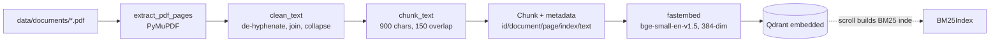

# Adaptive University RAG Assistant — Architecture

> This document describes the **actual implementation found in the source code**,
> not the original project plan. Where the built system differs from the
> original design, the difference is called out explicitly (see *Deviations
> From Original Plan* near the end, and *Intentionally Excluded Components*
> in §22).
>
> Source of truth: the repository code. Verified by reading every module in
> `backend/app/`, `frontend/src/`, `scripts/`, `backend/tests/`, and by running
> the test suite, the evaluation runner, and a live browser session.

---

## 1. System Overview

A single-user, stateless retrieval-augmented generation (RAG) application that
answers questions about university academic policies from a small corpus of
PDFs. It:

1. extracts, chunks and embeds PDFs offline into Qdrant;
2. classifies each incoming question with a **deterministic** router that picks
   one of exactly two retrieval strategies (NORMAL = vector only, HYBRID =
   vector + BM25);
3. builds a gated, deduplicated, size-bounded context;
4. generates a grounded answer through a provider-independent LLM layer
   (Groq primary → Ollama fallback), **or declines** without calling an LLM when
   no evidence passes the gate;
5. returns the answer with `[n]` citations plus structured observability
   metadata (strategy, strategy reason, provider, model, retrieval stats);
6. renders all of that in a React chat UI.

Scale characteristics: one FastAPI process, one embedded vector store, one
static frontend, no background workers, no conversation history.

**Size:** ~2,166 lines of backend app code, ~441 lines of frontend source,
~2,534 lines of tests, 15 test modules, 136 test functions.

---

## 2. Actual Technology Stack

### Backend (Python 3.13)

| Dependency | Version (pinned) | Why it is present / where used |
| --- | --- | --- |
| `fastapi` | 0.142.2 | HTTP entry point, request validation, response models — `backend/app/main.py` |
| `uvicorn[standard]` | 0.54.0 | ASGI server (`uvicorn app.main:app`) |
| `pydantic-settings` | 2.15.0 | Typed `Settings` loaded from env/`.env` — `backend/app/config.py` |
| `pymupdf` (import `fitz`) | 1.28.2 | PDF text extraction — `backend/app/ingestion.py` (also used to generate the demo PDFs) |
| `fastembed` | 0.8.1 | In-process ONNX embeddings (`BAAI/bge-small-en-v1.5`) — `backend/app/embeddings.py`; model cached in `backend/.models/` |
| `qdrant-client` | 1.19.1 | Vector store wrapper — `backend/app/vectorstore.py`; default to the **embedded** engine (`QDRANT_URL=local`) |
| `pytest` / `httpx` | 9.1.1 / 0.28.1 | Test suite + FastAPI `TestClient` transport |

Deliberately **absent**: LangChain, LangGraph, LlamaIndex, `requests`/`httpx`
in application code (all provider HTTP is stdlib `urllib.request`), `rank_bm25`
(BM25 is hand-written in `app/bm25.py`), a database driver, an ORM.

There is **no** `pyproject.toml`/`setup.py`; packaging is a plain
`backend/requirements.txt` plus `backend/pytest.ini`.

### Frontend

| Dependency | Version | Why / where |
| --- | --- | --- |
| `react` / `react-dom` | ^19.2.8 | UI rendering — `frontend/src/App.jsx` |
| `vite` + `@vitejs/plugin-react` | ^8.3.0 / ^6.1.1 | Dev server with `/api` + `/health` proxy, production build |
| `oxlint` | ^1.81.0 | Lint (`npm run lint`, configured in `.oxlintrc.json`) |

No router, no state library, no HTTP client library — plain `fetch` +
`useState`/`useRef`. No test framework on the frontend (lint + production build
+ an external CDP script, `frontend/scripts/verify_browser.mjs`, drive real
browser verification).

### Infrastructure / external services

- **Qdrant**: embedded in-process by default (`QDRANT_URL=local`), persisted to
  `data/qdrant_storage/`. `QDRANT_URL=http://...` switches to a server.
- **Groq**: hosted OpenAI-compatible chat API (`https://api.groq.com/openai/v1`),
  model `openai/gpt-oss-20b`.
- **Ollama**: local server `http://localhost:11434`, model `llama3.1`
  (`/api/chat`), used as the fallback generation provider and as an optional
  embedding provider (`nomic-embed-text`, not the default).
- **Docker**: see §20.
- **Scripts**: `scripts/generate_demo_corpus.py`, `scripts/verify_ingestion.py`,
  `scripts/run_evaluation.py`.
- **Environment**: `backend/.env` (git-ignored) seeded from `backend/.env.example`.

---

## 3. High-Level Architecture

Two paths share one corpus:

- **Offline ingestion**: `data/documents/*.pdf` → extract → clean → chunk →
  metadata → embed (fastembed) → Qdrant upsert.
- **Online answering**: React → FastAPI → RAG orchestrator → router →
  retriever (vector or vector+BM25) → context builder → LLM gateway →
  answer + citations → API → React.

The Qdrant payload is the **single source of truth** for the corpus: the BM25
lexical index is rebuilt from it at process start, so there is no second data
store to keep in sync.

---

## 4. End-to-End Request Flow

Traced through the actual code (this is the real flow, not a planned one):

```text
User types question in React input  (App.jsx handleSubmit)
        ↓
api.js sendChatMessage()  →  POST /api/chat  (fetch, 150 s abort timeout)
        ↓
main.py chat(request)  — pydantic ChatRequest validates `message` (1..2000 chars)
        ↓  invalid → 422
get_pipeline()  — lazily builds & caches (module-level dict, once per process):
                  embedding client, QdrantVectorStore, VectorRetriever,
                  BM25 index, HybridRetriever, LLM client, QueryRouter
        ↓
rag.py answer_question()
        ↓  empty query → ValueError → 422
routing.py QueryRouter.route(query) → RoutingDecision{strategy, reason, confidence}
        ↓
strategy selects retriever:
   "normal" → retriever.retrieve(query)      (vector only)
   "hybrid" → hybrid_retriever.retrieve(query) (vector + BM25 fused by RRF)
        ↓  list[RetrievedChunk] with scores + source metadata
context.py build_context(...)  → relevance gate(s) → near-duplicate removal →
                                 4000-char budget → BuiltContext
        ↓
   ┌─ context.enough_evidence == False ─────────────────────────────┐
   │   return INSUFFICIENT_EVIDENCE_ANSWER, sources=[], provider="none"
   │   ← THE LLM IS NEVER CALLED ──────────────────────────────────┘
        ↓
llm.py LLMClient.generate(system_prompt, user_query, context)
        ↓  FallbackLLMClient: Groq first; on availability/timeout/generation
           failure → Ollama; success at index > 0 relabels provider
           "<base>_fallback"
        ↓
rag.py normalizes 【n】 → [n], strips citation indices > block count
        ↓
RAGResult.to_api_dict() → ChatResponse
        ↓  finally: structured INFO log (request_id, strategy,
           strategy_reason, retrieval_count, provider, latency_ms) — the
           question text is deliberately NOT logged
        ↓
App.jsx sets message.meta → AnswerMeta renders strategy (title=reason),
provider, sources (document · Page N)
```

Notes that are true of the actual implementation:

- Endpoints are declared `def` (not `async def`), so FastAPI runs them in its
  thread pool; the blocking `urllib` calls inside do not stall the event loop.
- The request is **stateless**: no conversation history, no session, no
  streaming (single JSON response).

---

## 5. Frontend Architecture

| File | Role |
| --- | --- |
| `frontend/src/main.jsx` | React 19 entry; `StrictMode` + `createRoot('#root')` |
| `frontend/src/App.jsx` | The entire UI: chat state, submit handler, health polling, message rendering, `AnswerMeta` sub-component |
| `frontend/src/api.js` | API service: `checkHealth()`, `sendChatMessage()`, `ApiError`, HTTP-error decoding |
| `frontend/src/App.css`, `index.css` | Styles |
| `frontend/vite.config.js` | Dev proxy: `/api` and `/health` → `http://127.0.0.1:8000` |
| `frontend/scripts/verify_browser.mjs` | Headless-Chrome CDP integration test (dev tool, not app code) |

**Components:** only `App` and the local `AnswerMeta` (a `<dl>` showing
Strategy / Provider / Sources). There are no other components.

**State handling:** `messages` array (each entry `{id, question, answer, meta, error}`),
`input`, `busy`, `backendOnline` (`null` = checking).

**Chat flow:** `handleSubmit` guards empty/`busy`, appends a pending entry,
clears the input, calls `sendChatMessage`, then either fills `answer` + `meta`
or records `error`. A `finally` always clears `busy`.

**Health:** `useEffect` calls `checkHealth()` immediately and every 15 s; the
badge shows `Backend connected` / `Backend unavailable — start it with …` /
`Checking backend…`. It is a real probe, never a static label.

**Rendering:** answer text, then `AnswerMeta` (strategy label uppercased with
the router reason in `title`, provider label via `providerLabel()` mapping
`groq→Groq`, `ollama_fallback→Ollama fallback`, `none→—`, and a `sources` list).

**Error handling:** `ApiError` (kind `network`/`timeout`/`server`) carries a
user-safe message; `describeHttpError()` extracts FastAPI `detail`, preferring
the 422 message; any other failure falls back to a generic string. A failed
turn renders `.error-text` and never renders fake metadata.

---

## 6. Backend Architecture

Flat module layout (no sub-packages):

| Module | Responsibility |
| --- | --- |
| `app/main.py` | FastAPI app, CORS, schemas, `/health`, `/ready`, `/api/chat`, pipeline cache, error mapping, structured logging |
| `app/config.py` | `Settings` (pydantic-settings), cached `get_settings()` |
| `app/rag.py` | Orchestrator `answer_question()`, system prompt, `RAGResult`, citation normalization/stripping |
| `app/routing.py` | `QueryRouter` + `RoutingDecision` |
| `app/retriever.py` | `VectorRetriever`, `HybridRetriever`, `_rrf_combine` |
| `app/bm25.py` | Okapi BM25 index + `build_bm25_index()` |
| `app/context.py` | Gates, dedupe, budget, `render_context()` |
| `app/vectorstore.py` | Qdrant wrapper, point IDs, payload, search/scroll |
| `app/embeddings.py` | `EmbeddingClient` protocol, local + Ollama providers |
| `app/llm.py` | `LLMClient` protocol, Groq/Ollama clients, `FallbackLLMClient`, error taxonomy, `build_llm_client()` |
| `app/ingestion.py` | PDF → clean → chunk → `Chunk` metadata (no network) |
| `app/ingest.py` | Ingestion orchestration + CLI (`python -m app.ingest`) |

**Pipeline construction** (`main.get_pipeline`) is a module-level `dict` cache
built on first use; tests monkeypatch `main.get_pipeline` to inject fakes.
There is **no** DI container and no startup event — object construction is lazy.

**Request/response schemas** live in `main.py`:
- `ChatRequest { message: str = Field(min_length=1, max_length=2000) }`
- `ChatResponse { answer, sources[{document,page}], enough_evidence, retrieval{chunks_retrieved, chunks_used, top_score}, provider, model, strategy, strategy_reason }`
- `HealthResponse { status, service, environment }`, `ReadyResponse { status, checks }`

---

## 7. RAG Orchestrator

`backend/app/rag.py::answer_question()` is the single orchestrator. Sequence:

1. `query.strip()`; empty → `ValueError` (API maps to 422).
2. **Routing** — if `router` *and* `hybrid_retriever` are supplied, use
   `router.route()`; otherwise fall back to `_DEFAULT_DECISION`
   (`normal`, reason *"Router not configured; using the default vector
   strategy."*). In the real API both are always present (they come from the
   pipeline cache); the fallback exists for the Phase-3-style/test wiring.
3. **Retriever selection** — `normal` → normal retriever, `min_bm25_score=None`;
   anything else (only `hybrid` in practice) → hybrid retriever with
   `settings.min_bm25_score`.
4. **Retrieve** → `list[RetrievedChunk]`.
5. **Context** → `build_context(...)`.
6. **Gate** — if `context.enough_evidence` is false, return the controlled
   decline with `provider="none"`; **the LLM is not called**.
7. **Generate** — `llm.generate(system_prompt, user_query, render_context(context))`.
8. **Normalize + ground** — `【1】` → `[1]` (Groq `gpt-oss-20b` emits full-width
   brackets), then `_strip_unsupported_citations()` removes any `[k]` where
   `k > len(blocks)` (stripping, not rejecting, so a usable answer survives one
   stray marker).
9. Build `RAGResult`; `sources` are derived from **every block in the final
   context** (`_citations_from_context`), not from the markers that actually
   appear in the answer text.

---

## 8. Query Routing

Implemented entirely in `backend/app/routing.py` — **one class, `QueryRouter`**.
There is no separate "query analysis" module and **no LLM is involved**.

### Signals → `hybrid_score`

| Signal | Regex / rule | Score |
| --- | --- | --- |
| Course code | `\b[A-Z]{2,5}[ -]?\d{3,4}\b` (e.g. `CS201`, `ENCT 353`) | +2 |
| Acronyms | `\b[A-Z]{2,6}\b` (distinct matches) | +1 |
| Terminology terms | word match against a fixed set: policy, regulation(s), ordinance, clause, section, appendix, syllabus, schedule, prerequisite, eligibility, fee(s), code, credit(s) | +1 |
| Several figures | ≥ 2 `\d+` tokens | +1 |
| Multi-part | `\b(and|or|vs)\b` | +1 |

### Decision table

| Condition | Result | Confidence |
| --- | --- | --- |
| `score == 0` **and** query starts with a conceptual prefix (`what is/are/does/do`, `why`, `how`, `when`, `where`, `who`, `which`, `explain`, `describe`, `define`) **and** ≤ 10 words | **NORMAL** | medium |
| `score >= 2` | **HYBRID** | high |
| `score == 1` | **HYBRID** | medium |
| `score == 0` and not (short conceptual) | **HYBRID** (deliberate default) | low |

Answering the required questions literally:

- **Are there other strategies?** No — exactly two constants,
  `STRATEGY_NORMAL = "normal"` and `STRATEGY_HYBRID = "hybrid"`. A WEB strategy
  is **not implemented**.
- **Deterministic?** Yes — pure function of the query text; no randomness, no
  model, no I/O.
- **Uncertain routing?** Defaults to HYBRID, with the reason
  *"No confident signal; defaulting to hybrid so lexical matches are not
  missed."*
- **Confidence thresholds?** **Not implemented.** `confidence` is an
  informational string (`high`/`medium`/`low`) attached to the decision; no code
  in the pipeline reads it to alter behaviour.
- The router also returns a human-readable `reason` naming the triggering
  signals, which is surfaced in the API response and the UI tooltip.

### Deviation note (§8.1)

The original design described a separate **"Query Analysis"** stage feeding a
**"Strategy Router"**. The actual implementation has **one router class** doing
analysis and selection inline with regex signals. The observable contract
(strategy + reason + confidence) is the same; there is no standalone analysis
component to document.

---

## 9. Retrieval Architecture

Shared types (`app/retriever.py`): `RetrievedChunk {chunk_id, text, document,
page, score, chunk_index, semantic_score, bm25_score}`.

### 9.1 Normal Vector Retrieval

`VectorRetriever`:

- **Embedding model**: `BAAI/bge-small-en-v1.5` (fastembed, 384-dim) — the
  query is embedded with `embed_query()` which is `embed_texts([q])[0]`. **No
  query/passage instruction prefix is applied** (raw text is embedded).
- **Vector database**: Qdrant, collection `university_docs`, COSINE distance.
- **Similarity method**: cosine similarity; results returned in rank order.
- **top-k**: `RETRIEVAL_TOP_K` (default 5).
- **Filtering**: **none at the retriever** — relevance filtering happens later
  in the context builder.
- **Metadata**: every hit reconstructs `chunk_id, document_name, page,
  chunk_index, text, score`.

### 9.2 Hybrid Retrieval

`HybridRetriever.retrieve()`:

1. `vector_results = VectorRetriever.retrieve(query)` → top-k (k = `top_k`).
2. `lexical_hits = BM25Index.search(query, top_k)` → top-k lexical candidates.
3. **Score combination**: Reciprocal Rank Fusion, `_rrf_combine` with `k=60`,
   summing `1/(k + rank + 1)` over the two ranked id lists. Ranks (not raw
   scores) drive the fusion, so cosine and BM25 scales never have to be
   comparable.
4. **Deduplication**: by `chunk_id` — a chunk in both lists contributes twice to
   the fused score but appears once in the output.
5. **Truncation**: first `top_k` fused ids are kept.
6. **Score preservation**: `semantic_score` (if present in vector results),
   `bm25_score` (if present in lexical hits), `score` = semantic if available
   else BM25 (used as the display score).
7. **Filtering**: none at the retriever; gates applied later.

### 9.3 BM25

`app/bm25.py` — **hand-written Okapi BM25**, pure Python, `k1=1.5`, `b=0.75`.

- **Indexing**: `build_bm25_index(store)` scrolls every Qdrant payload and
  adds each `Chunk`. Built **once per process** inside `get_pipeline()`.
  (Consequence: if the corpus is re-ingested while the server runs, the
  in-memory BM25 index is stale until restart — see §25.)
- **Tokenization**: `[a-z0-9]+` runs, lowercased — `CS201`, `cs201`, `cs 201`
  normalize identically.
- **Scoring**: per-term IDF `log(1 + (N - df + 0.5)/(df + 0.5))`, tf saturated
  by `k1`, length-normalized by `b`; only terms present in the document
  contribute; unique query terms only.
- Returns top-k `LexicalHit {chunk_id, score, text, document, page, chunk_index}`.

---

## 10. Document Ingestion Pipeline

Actual flow (`app/ingestion.py` + `app/ingest.py`):

```text
data/documents/*.pdf
  ↓ discover_pdfs()          recursive (rglob), *.pdf, sorted by path; 0 PDFs → error
  ↓ extract_pdf_pages()      PyMuPDF (fitz) get_text per page; blank pages skipped;
  |                          a PDF with no extractable text → DocumentIngestionError
  |                          ("scanned PDF? OCR is not implemented yet")
  ↓ clean_text()             CRLF→LF, de-hyphenate across line breaks,
  |                          join lines, collapse whitespace
  ↓ chunk_text()             character chunks ≤ CHUNK_SIZE (900) with
  |                          CHUNK_OVERLAP (150), word-boundary packing,
  |                          deterministic, never splits a word
  ↓ Chunk metadata           id = "<stem>::p<page>::c<index>",
  |                          document_name, source_path, page, chunk_index, text
  ↓ embedding.embed_texts()  fastembed, dim 384, batch 64
  ↓ Qdrant upsert            point id = UUIDv5("unirag:" + chunk_id)
                             → re-ingesting overwrites instead of duplicating
```

- **Supported document types**: PDF only (`*.pdf`), flat directory.
- **Text extraction library**: PyMuPDF.
- **OCR**: **Not implemented.** Scanned PDFs raise `DocumentIngestionError`;
  there is no OCR code path anywhere in the repository.
- **Metadata fields stored in the Qdrant payload**: `chunk_id`,
  `document_name`, `source_path`, `page`, `chunk_index`, `text`
  (`vectorstore.PAYLOAD_KEYS`).
- **Collection**: `university_docs` (COSINE, 384 dims); `ensure_collection()`
  verifies an existing collection's dimension and fails loudly on mismatch.
- **Indexing process**: manual CLI `python -m app.ingest [--recreate]`; not a
  startup hook, not a background job.
- **Embedding-dim guard**: `ingest_directory()` aborts if `EMBEDDING_DIM` in
  config ≠ the client's real dimension.

---

## 11. Embedding Architecture

`EmbeddingClient` **protocol** (`name`, `dim`, `embed_texts`, `embed_query`) with
two implementations selected by `EMBEDDING_PROVIDER`:

| Provider | Implementation | Notes |
| --- | --- | --- |
| `local` (default) | `LocalEmbeddingClient` | fastembed in-process ONNX; model downloaded once to `backend/.models/`; dimension discovered lazily by embedding a probe string; batch size 64 |
| `ollama` | `OllamaEmbeddingClient` | `POST /api/embed` on `OLLAMA_BASE_URL` with `OLLAMA_EMBEDDING_MODEL` (default `nomic-embed-text`) |

Unknown provider → `EmbeddingError`. Output is validated
(`_validate_vectors`): count must match input, every value must be a finite
`float`, else `EmbeddingError`.

---

## 12. Qdrant Architecture

`app/vectorstore.py` wraps `qdrant_client` so the rest of the system never
imports Qdrant types (store is swappable, tests inject fakes).

**Client selection** (`_build_client`):

| `QDRANT_URL` | Behaviour |
| --- | --- |
| `local` (default) | **Embedded engine in-process**, persisted to `data/qdrant_storage/` — no server, no Docker |
| `path:<dir>` | Embedded engine, explicit path |
| `:memory:` | Embedded engine, ephemeral (used by tests) |
| `http(s)://...` | Real Qdrant server (supported, not required) |

**Operations**: `ensure_collection()` (create + dimension verification),
`ping()` (used by `/ready`), `reset()` (`--recreate`), `upsert_chunks()`,
`search()` (COSINE `query_points`, payload validated — missing keys raise
rather than degrade), `scroll_chunks()` (rebuild source for BM25).

Deterministic UUIDv5 point ids make re-ingestion idempotent. The engine takes
an **exclusive file lock**, so the API server and the evaluation runner cannot
be open at the same time.

---

## 13. Context Construction

`app/context.py::build_context(chunks, min_score, max_chars, min_bm25_score)` —
per-chunk pipeline, in order:

1. **Relevance gate** (`_passes_relevance_gate`):
   - chunk with a `semantic_score` → kept if `semantic_score >= min_score`
     (default `MIN_RELEVANCE_SCORE = 0.45`);
   - lexical-only chunk (no semantic score) → kept only if
     `bm25_score >= min_bm25_score` (default `MIN_BM25_SCORE = 1.0`) **and**
     `min_bm25_score` was supplied (it is supplied only on the HYBRID path);
   - chunk with neither score → rejected.
2. **Near-duplicate removal**: a chunk whose normalized text is contained in
   (or contains) an already-kept block is dropped.
3. **Budget**: chunk is skipped if adding it would exceed `MAX_CONTEXT_CHARS`
   (4000); the loop breaks at/over budget. `max_chars <= 0` → `ValueError`.

Result: `BuiltContext {blocks, enough_evidence, total_chars}` where
`enough_evidence = bool(blocks)` — **one surviving block is enough** to call the
LLM.

`render_context()` formats each block as
`[n] source: <document>, page <n>\n<text>`, joined by blank lines — this is the
numbered evidence the model cites.

---

## 14. Grounding and Citations

- **How context is passed**: one `user` turn built by
  `build_user_content()` → evidence framed as numbered, citable sources,
  followed by the question and the answering task, preceded by a fixed
  `SYSTEM_PROMPT`. The turn is identical for Groq and Ollama.
- **Grounding instructions** (in `app/rag.py::SYSTEM_PROMPT`): use ONLY the
  supplied sources; never invent; cite with `[1]`/`[2]` directly after each
  claim; adapt style/length/structure to the user's request (facts,
  definitions, summaries, notes, comparisons, procedures, requested word
  limits); synthesize rather than reproduce sources; if the evidence lacks the
  answer, reply with the exact decline sentence; never expose internal system
  details.
- **Insufficient-evidence handling**: two independent layers —
  1. *Retrieval gate*: no block survives → controlled
     `INSUFFICIENT_EVIDENCE_ANSWER`, `sources=[]`, `enough_evidence=false`,
     `provider="none"`, **LLM not called** (deterministic).
  2. *Model behavior*: if blocks survive but don't answer, the model is
     instructed to emit the same sentence (verified live on `sem-06`/`none-17`).
- **Citation format**: `[n]` referencing the numbered block index; full-width
  CJK brackets normalized first.
- **Validation**: `_strip_unsupported_citations` deletes markers with an index
  outside `1..block_count`.
- **Source metadata**: `SourceCitation {document, page, chunk_index, score}` →
  API `sources: [{document, page}]`.
- **To the frontend**: `data.sources` → `AnswerMeta` renders
  `document · Page N`.
- **Hallucination detector**: **not implemented.** There is no separate
  verifier/groundedness scorer — grounding is enforced by prompt design, the
  evidence gate, and citation index validation. The evaluation runner measures
  groundedness heuristically post-hoc (§19), not at runtime.

---

## 15. LLM Provider Architecture

### 15.1 Provider Interface

`LLMClient` **protocol** in `app/llm.py`: attribute `name` and
`generate(system_prompt, user_query, context) -> LLMResponse{text, provider, model}`.
The RAG layer depends only on this protocol.

**Error taxonomy** (all derive from `LLMError`):

| Class | Meaning | Fallback trigger? |
| --- | --- | --- |
| `LLMConfigurationError` | Bad/missing key, unknown provider, invalid config | **No** — must be fixed by the deployment |
| `LLMUnavailableError` | Unreachable, 429, 5xx | Yes |
| `LLMTimeoutError` | Timeout (408 or elapsed) | Yes |
| `LLMGenerationError` | Malformed/empty completion, other 4xx | Yes |

HTTP mapping in `_raise_http_error()`: 401/403 → configuration; 408 → timeout;
429 or ≥500 → unavailable; other 4xx → generation. Error bodies are truncated
to 200 chars and only reach the **server log**.

### 15.2 Groq

`GroqLLMClient`, `name="groq"`: `POST {GROQ_BASE_URL}/chat/completions`,
OpenAI-style payload (system message + user message, `temperature=0.1`,
`stream=false`), headers `Authorization: Bearer <key>` and
`User-Agent: unimind-rag/0.1` (Groq's WAF rejects the default urllib UA).
Model: `GROQ_MODEL` (default `openai/gpt-oss-20b`; llama-3.x was decommissioned
on Groq, per the config comment). The API key is stored privately, never
logged, never echoed.

### 15.3 Ollama

`OllamaLLMClient`, `name="ollama"`: `POST {OLLAMA_BASE_URL}/api/chat`,
model `OLLAMA_MODEL` (default `llama3.1`), `stream=false`, `options:
{temperature, num_ctx: 8192}`.

### 15.4 Fallback Logic

`build_llm_client(settings)`:

| `LLM_PROVIDER` | Result |
| --- | --- |
| `auto` (default) | If `GROQ_API_KEY` set → `FallbackLLMClient([groq, ollama])`; if empty → `OllamaLLMClient` only (Groq skipped with a warning) |
| `groq` | Groq only (empty key → `LLMConfigurationError` at build time) |
| `ollama` | Ollama only |
| anything else | `LLMConfigurationError` |

`FallbackLLMClient.generate()` walks the list in order:

1. **Groq succeeds** (index 0) → response returned as `provider="groq"`.
2. **Groq fails** with an availability/timeout/generation error → the failure is
   recorded and the next client is tried; **Ollama succeeds** → response
   relabeled `provider="ollama_fallback"` so failover is observable.
3. **Ollama succeeds** directly (single-provider chain) → `provider="ollama"`,
   no relabeling (`test_fallback_single_provider_is_not_relabeled`).
4. **Both fail** → single `LLMUnavailableError("All LLM providers failed: …")`
   listing each provider's reason → API 503.
5. **Configuration error at any point** → propagates immediately, **no
   fallback** (a rejected key must not be masked).

---

## 16. API Architecture

| Method | Path | Purpose | Request | Response | Errors |
| --- | --- | --- | --- | --- | --- |
| `GET` | `/health` | Liveness (does **not** touch dependencies) | — | `{status:"ok", service, environment}` | none |
| `GET` | `/ready` | Readiness: builds pipeline, `store.ping()`, embedding probe | — | `{status:"ready", checks:{vector_store, embedding_model}}` | **503** `{status:"unready", checks:{vector_store:<reason>}}` |
| `POST` | `/api/chat` | Grounded answering | `{message: string (1..2000)}` | `ChatResponse` (see §16.1) | 422 / 503 / 500 |
| — | anything else | — | — | — | **404** |

### 16.1 `POST /api/chat` response (actual fields)

```json
{
  "answer": "…",
  "sources": [{"document": "attendance_policy.pdf", "page": 1}],
  "enough_evidence": true,
  "retrieval": {"chunks_retrieved": 5, "chunks_used": 5, "top_score": 0.72},
  "provider": "groq",
  "model": "openai/gpt-oss-20b",
  "strategy": "hybrid",
  "strategy_reason": "Lexical matching is valuable: course code 'CS201'."
}
```

**CORS**: `CORSMiddleware` is added only when `CORS_ALLOWED_ORIGINS` is
non-empty (default covers the Vite dev origins). In development the browser
still talks same-origin because the Vite proxy forwards `/api` and `/health`.

---

## 17. Error Handling

Trace of the required scenarios (actual behavior):

| Scenario | Actual behavior |
| --- | --- |
| Invalid request (missing/over-long/oversized `message`, malformed JSON) | Pydantic → **422** with field detail |
| Empty / whitespace-only query reaching `answer_question` | `ValueError` → **422** |
| Qdrant/vector store unavailable (retrieve path) | `RetrievalError`/`EmbeddingError`/`VectorStoreError` → **503** `"retrieval pipeline unavailable"`; `logger.exception` server-side |
| Qdrant unavailable at readiness | `/ready` → **503** with the failing check |
| Groq unreachable / 429 / 5xx | `LLMUnavailableError` → chain tries Ollama → answer returned with `provider=ollama_fallback` |
| Ollama unavailable (and Groq already failed) | `LLMUnavailableError` from Ollama → chain exhausts → **503** `"generation pipeline unavailable"` |
| Both LLM providers unavailable | Single `LLMUnavailableError` → **503** `"generation pipeline unavailable"` |
| Model timeout | `LLMTimeoutError` → treated as fallback-worthy; if all providers time out → **503** |
| Bad provider config (unknown `LLM_PROVIDER`, missing key in `groq` mode, 401/403 at runtime) | `LLMConfigurationError` → **500** `"generation pipeline misconfigured"` (**no fallback**) |
| No relevant evidence | **200** with controlled decline, `sources=[]`, `provider="none"` |

Client-visible messages are always generic strings; stack traces, API keys and
environment values are never returned (the one nuance: `/ready`'s 503 body
embeds `str(exc)` for operators).

---

## 18. Logging and Observability

- Python `logging` via module loggers (`app.main`, `app.llm`).
- One **structured INFO log per chat request** (in the `finally` block, so it
  also fires on failure):
  `chat request_id=%s strategy=%s strategy_reason=%s retrieval_count=%s provider=%s latency_ms=%d`
  — operational metadata only; **the question text is deliberately excluded**
  (asserted by `test_chat_request_log_has_metadata_but_no_question_text`).
- `request_id` is `uuid4().hex[:8]`.
- Infrastructure failures use `logger.exception` (full traceback in the server
  log only); readiness failures log a warning.
- Every API response carries machine-readable observability: `strategy`,
  `strategy_reason`, `provider`, `model`, `retrieval.*`.
- No metrics backend, no tracing, no log aggregation — none is implemented.

---

## 19. Testing and Evaluation

### 19.1 Test suite (verified, not assumed)

`backend/` + `pytest.ini` (`testpaths = tests`, `pythonpath = .`) → **15 test
modules + `conftest.py`, 136 test functions, 135 pass + 1 skip.**

| Module | Focus | Real vs fake |
| --- | --- | --- |
| `test_health.py` (3) | `/health` shape, content type, 404 | Real FastAPI app via `TestClient` |
| `test_api_chat.py` (14) | `/ready` success/503, grounded answer, insufficient evidence, validation (empty/whitespace/overlong/malformed), 503 mappings, log content, hybrid dispatch | Real app; pipeline fakes injected via monkeypatch |
| `test_rag.py` (13) | Grounding, citations, unsupported-marker stripping, CJK normalization, context budget, empty query, router dispatch, hybrid gating | Real orchestrator; fake embedding/Qdrant/LLM |
| `test_routing.py` (10) | Each signal, both defaults, empty query | Pure unit |
| `test_hybrid.py` (7) | Candidate combination, metadata preservation, dedupe, RRF-vs-concatenation ordering, top-k | Unit + real vector/BM25 integration |
| `test_bm25.py` (8) | Tokenization, ranking, determinism, top-k, replace-by-id, index rebuild from payloads | Pure unit |
| `test_context.py` (11) | Thresholds, dedupe, budget, rendering, BM25-only gate semantics | Pure unit |
| `test_llm.py` (13) | Ollama client request/response/errors, `build_llm_client` for every `LLM_PROVIDER` value | Ollama exercised against a local HTTP stub |
| `test_groq.py` (11) | Payload, auth/timeout/unavailable mapping, malformed completion, config validation, **key never echoed** | Local HTTP stub |
| `test_fallback.py` (8) | Groq success, failover on 503/timeout/refused, all-fail, **config error does not fall back**, relabeling | Two local `HTTPServer` stubs |
| `test_embeddings.py` (7) | Local/Ollama provider selection, batch embed, error wrapping | Real config, stub HTTP for Ollama |
| `test_ingestion.py` (11) | Cleaning, chunking size/overlap/word bounds, metadata, page numbering, scanned-PDF rejection | Real PyMuPDF PDFs written by `conftest.write_pdf` |
| `test_ingest_pipeline.py` (5) | Full pipeline report, payload metadata, idempotent re-ingest, typed errors, dim mismatch | Fake embedding + fake Qdrant client |
| `test_vectorstore.py` (13) | Point-id determinism, create/verify, upsert/search round-trip, re-ingest overwrite, payload validation, reset | Fake Qdrant client |
| `test_qdrant_integration.py` (2) | `:memory:` real-engine round trip (**always runs**); live-server round trip (**skipped** unless `QDRANT_URL` points at a reachable server) | Real Qdrant |

Fixtures/fakes live in `tests/conftest.py`: `FakeEmbedding` (deterministic
hash-based), `FakeQdrant` (in-memory), `FakeLLM`, `FakeRetriever`,
`make_retrieved()`, `write_pdf()`.

### 19.2 Evaluation

- **Dataset**: `backend/evaluation/dataset.json` — 18 hand-written cases across
  simple-factual, semantic, exact-terminology, course-code, multi-concept,
  multi-source, no-answer, ambiguous; each carries `expected_strategy`,
  `relevant_source`, an `answer_must_mention[/_any]` content expectation, and
  `insufficient_evidence_expected`.
- **Runner**: `scripts/run_evaluation.py` builds the *same* pipeline as the API
  (in-process, nothing mocked) and writes `--json <path>`.
- **Signals computed per case**: `routing_ok`, `evidence_ok` (gate vs
  expectation), `top1_relevant`, `top3_relevant`, `mention_ok`, `decline_ok`,
  `citations_present`, `chunks_retrieved`, `top_score`, `latency_ms`, `pass`.
- **Exit status**: 1 if any case fails (so it is CI-friendly but the run I did
  exits 1 by design when failures exist).
- **Latest real run** (2026-10-06): 12/18 pass, routing 16/18, evidence gate
  15/18, 14 grounded+cited, 1 retrieval-gate decline, 2 live Ollama fallbacks.
  Known weaknesses (documented in `backend/evaluation/REPORT.md`): tiny corpus,
  two router judgment calls, `course-11` over-generalization, and the runner
  counting honest LLM-path declines as failures.

There is **no** frontend unit-test framework and **no** CI configuration in the
repository.

---

## 20. Docker / Deployment

```text
Docker: Not implemented
```

Verified: no `Dockerfile`, no `docker-compose*`, no `.dockerignore` anywhere in
the repository.

- **Why**: the default configuration is deliberately server-free — Qdrant runs
  **embedded in-process** (`QDRANT_URL=local`) and embeddings run in-process via
  fastembed, so the demo needs no container, no server, and no Docker daemon.
- **Deployment that actually exists**: `cd backend && uvicorn app.main:app
  --reload` and `cd frontend && npm run dev` (Vite proxy → FastAPI), plus
  `npm run build` producing static `frontend/dist/`.
- `QDRANT_URL=http://...` already supports a containerized Qdrant server with
  **no code change** if desired; the README documents this as an optional path
  (fastembed cache `backend/.models/` and `data/qdrant_storage/` would need
  volumes, and ingestion must run once against that server).
- No Kubernetes, no orchestration, no cloud deployment, no CI/CD.

---

## 21. Security Considerations

| Area | Actual state |
| --- | --- |
| Secrets | `backend/.env` holds `GROQ_API_KEY`; **git-ignored** (`.env`, `.env.*`, `!.env.example`). `backend/.env.example` contains only placeholders. Verified: no key/token/password literal exists in tracked source. |
| Key handling | Stored on a private attribute in `GroqLLMClient`; never logged, never returned; `test_groq_errors_do_not_echo_the_api_key` asserts it. |
| Stack traces | Never returned to clients; `HTTPException` details are generic strings; tracebacks go to the server log only. |
| Chat privacy | Request log excludes the question text (test-asserted). |
| Error bodies | Provider error snippets truncated to 200 chars and server-log-only. |
| CORS | Explicit allow-list from `CORS_ALLOWED_ORIGINS` (Vite origins by default). |
| Input limits | `message` bounded 1..2000 chars; context bounded to 4000 chars. |
| `/ready` 503 body | Embeds `str(exc)` — operator-facing detail; the only place an internal reason reaches the wire (noted as a nuance, not a secret leak). |
| Auth | **Not implemented** — no authentication, no rate limiting, no CSRF (single-user local app). |
| Prompt injection | The system prompt instructs evidence-only answering, but there is **no** input sanitization or injection defense layer. |

---

## 22. Intentionally Excluded Components

**Intentionally excluded** (out of scope by design — the project uses the
minimum architecture needed to demonstrate adaptive RAG; extra infrastructure
would raise operational cost without enough value here; each could become
reasonable at larger scale or under different requirements):

| Excluded | Actual reasoning |
| --- | --- |
| Neo4j / Graph RAG | Corpus is flat policy text; no relationship traversal |
| PostgreSQL / any relational DB | Qdrant already persists vectors **and** payloads; no transactional state exists to store |
| Redis | No cache or queue hot path; retrieval is one round-trip per request |
| Kubernetes / microservices | Single FastAPI process + one static frontend; easier to run, debug, demo |
| Complex agent frameworks (LangChain, LangGraph, agent loops) | The pipeline is a fixed, transparent sequence; agents would add a failure surface for no benefit |
| Authentication | Single-user local demo |
| WebSockets / streaming | Single JSON response per question; no long-lived channel needed |
| Queues / background workers | Every request is served synchronously in one process |
| Cloud infrastructure / CI-CD | Not needed for a laptop demo |

**Not implemented but potentially useful future improvements** (documented as
such, not built):

- Web-search retrieval strategy (WEB) — listed in README as deferred.
- OCR for scanned PDFs — explicitly rejected at runtime with a clear error.
- Learned/LLM-assisted routing; cross-encoder reranking.
- Conversation history / multi-turn memory (currently stateless).
- A groundedness/verifier model at runtime (only heuristic post-hoc evaluation
  exists).
- Frontend unit tests, CI pipeline, Docker packaging, rate limiting, metrics.

---

## 23. Actual Architecture Diagram

```mermaid
flowchart TD
    U[User] --> UI[React App<br/>App.jsx + api.js]
    UI -->|POST /api/chat| API[FastAPI<br/>main.py: chat + pydantic validation]
    API --> ORCH[answer_question<br/>rag.py]
    ORCH --> RTR{QueryRouter<br/>routing.py — deterministic signals}
    RTR -->|normal| VEC[VectorRetriever]
    RTR -->|hybrid| HYB[HybridRetriever]
    HYB --> VEC
    HYB --> BM[BM25Index<br/>bm25.py, built from payloads]
    VEC --> QD[(Qdrant<br/>embedded engine, university_docs)]
    BM -.reads payloads at startup.-> QD
    VEC --> CTX[build_context<br/>context.py: gate → dedupe → budget]
    HYB --> CTX
    CTX -->|no block survives| DECL[Controlled decline<br/>provider=none, LLM NOT called]
    CTX -->|evidence| LLMD{LLMClient<br/>llm.py}
    LLMD -->|primary| GQ[GroqLLMClient<br/>openai/gpt-oss-20b]
    LLMD -->|fallback| OL[OllamaLLMClient<br/>llama3.1]
    GQ -->|availability/timeout/generation error| OL
    GQ -->|success| RES[RAGResult<br/>normalize 【】 → [n], strip out-of-range citations]
    OL --> RES
    DECL --> RES
    RES --> RESP[ChatResponse: answer, sources, strategy, reason, provider]
    RESP --> UI2[AnswerMeta<br/>answer · sources · strategy · provider]
    UI2 --> U
```

**Offline ingestion path:**



---

### 23.1 Component → File Map (the actual paths)

Every major component below is traced to the file that actually implements it,
read from the repository (not from the plan):

| Component | Actual File/Module | Responsibility |
| --- | --- | --- |
| FastAPI entry / app | `backend/app/main.py` | App, CORS, middleware, schemas, `/health`, `/ready`, pipeline cache |
| Chat API | `backend/app/main.py::chat` | Validate → orchestrate → map errors → log → respond |
| RAG Orchestrator | `backend/app/rag.py::answer_question` | Route → retrieve → context → gate → generate → ground |
| Query Router | `backend/app/routing.py::QueryRouter` | Deterministic NORMAL/HYBRID decision + reason + confidence |
| Query analysis | `backend/app/routing.py` (inline) | Signals are computed inside `route()` — no separate stage |
| Vector Retriever | `backend/app/retriever.py::VectorRetriever` | Embed query → Qdrant cosine search |
| Hybrid Retriever | `backend/app/retriever.py::HybridRetriever` | Vector + BM25 fused by RRF |
| RRF fusion | `backend/app/retriever.py::_rrf_combine` | Rank-based combination, `k=60` |
| BM25 | `backend/app/bm25.py::BM25Index`, `build_bm25_index` | Hand-written Okapi BM25 over Qdrant payloads |
| Qdrant / vector store | `backend/app/vectorstore.py::QdrantVectorStore` | Collection mgmt, upsert, search, scroll, payloads |
| Context builder | `backend/app/context.py::build_context` / `render_context` | Gates, dedupe, budget, numbered evidence |
| Embedding interface | `backend/app/embeddings.py::EmbeddingClient` | Protocol + local/Ollama providers |
| Ingestion (text) | `backend/app/ingestion.py` | PDF extract, clean, chunk, `Chunk` metadata |
| Ingestion (orchestration/CLI) | `backend/app/ingest.py::ingest_directory`, `main` | PDF → embed → Qdrant, `python -m app.ingest` |
| LLM interface | `backend/app/llm.py::LLMClient` | Protocol consumed by `rag.py` |
| Groq | `backend/app/llm.py::GroqLLMClient` | Hosted OpenAI-compatible client |
| Ollama | `backend/app/llm.py::OllamaLLMClient` | Local `/api/chat` client |
| Fallback | `backend/app/llm.py::FallbackLLMClient`, `build_llm_client` | Ordered failover + provider relabeling |
| Configuration | `backend/app/config.py::Settings` | All env-driven values, no hardcoded secrets |
| Frontend entry | `frontend/src/main.jsx` | React 19 mount |
| Frontend UI / chat state | `frontend/src/App.jsx` | Chat, health polling, rendering, `AnswerMeta` |
| Frontend API service | `frontend/src/api.js` | `checkHealth`, `sendChatMessage`, `ApiError` |
| Frontend build/dev config | `frontend/vite.config.js` | `/api`, `/health` dev proxy |
| Demo corpus generator | `scripts/generate_demo_corpus.py` | Deterministic synthetic PDFs |
| Evaluation runner | `scripts/run_evaluation.py` | Real-pipeline evaluation, JSON output |
| Ingestion verification | `scripts/verify_ingestion.py` | Manual similarity-search check |
| Evaluation dataset/report | `backend/evaluation/dataset.json`, `report.json`, `REPORT.md` | 18 cases + latest results |
| Tests | `backend/tests/` (15 modules + `conftest.py`) | Unit/integration coverage |

---

## 24. Engineering Tradeoffs

**What the implementation chose, and why (as evidenced in code):**

- **Two retrieval strategies, not a general retrieval framework** — a constant
  `STRATEGY_NORMAL`/`STRATEGY_HYBRID` pair keeps dispatch trivially testable.
- **Deterministic regex routing over an LLM router** — free, instant,
  explainable (`strategy_reason` is returned for every answer); the cost is a
  fixed signal table that mis-routes some surface forms (`sem-04`, `term-07`).
- **RRF over weighted score blending** — avoids having to make cosine and BM25
  comparable; cost: only *rank* information survives fusion.
- **Hand-written BM25 over a library** — the scoring formula stays readable and
  dependency-free; cost: not optimized for large corpora.
- **Embedded Qdrant over a server** — zero-infra demo; cost: exclusive file
  lock (server and evaluation runner can't co-exist), single-process only.
- **Prompt + gate + citation-index validation over a hallucination detector** —
  simple and testable; cost: no independent groundedness check at runtime.
- **stdlib `urllib` over an SDK** — no extra dependency, explicit error
  mapping; cost: hand-rolled timeout/JSON handling.
- **Synchronous request handling over streaming** — one JSON response keeps the
  UI and tests simple; cost: long answers block the request (browser timeout
  is 150 s to stay above the 120 s server timeout).

**Tradeoff summary:** minimum operational complexity and maximum explainability
in exchange for scale-out options, multi-turn capability, and richer retrieval.

---

## 25. Known Limitations

1. **Corpus is 5 chunks** — `top_k=5` returns everything, so top-3 relevance is
   trivially satisfied; retrieval quality cannot be meaningfully measured.
2. **Stale BM25 / router process state** — the BM25 index and Qdrant client are
   built once per process; re-ingesting while the server runs does not refresh
   the lexical index until restart.
3. **Router edge cases** — a fixed terminology/prefix table routes `sem-04` and
   `term-07` differently than a human would.
4. **Over-generalization** (`course-11`): a course code absent from the corpus
   can still be answered from the general policy text instead of declining.
5. **No query instruction prefix** for the BGE embedding model.
6. **`sources` lists all context blocks**, not only the blocks the final answer
   actually cited.
7. **Stateless** — no conversation history; each request is independent.
8. **Evaluation runner semantics** — `evidence_ok` counts only retrieval-gate
   declines, so honest LLM-path declines score as FAIL; generation is
   non-deterministic run to run.
9. **Single-user local deployment** — no auth, rate limiting, or streaming.
10. **`/ready`** leaks an exception string into its 503 body (operator-facing).

---

## 26. Possible Future Improvements

Clear future work (not implemented, and explicitly out of the current scope):

- Web-search strategy and OCR for scanned PDFs.
- Learned (LLM-assisted) routing and cross-encoder reranking.
- Multi-turn conversation memory.
- A runtime groundedness verifier distinct from the prompt/gate.
- Larger, real (non-synthetic) corpus for meaningful retrieval metrics; fixing
  the evaluation runner's decline accounting.
- Docker packaging (Qdrant server + volume-mounted model cache) if the local
  setup ever stops being the source of truth.
- Frontend unit tests and a CI pipeline.
- Metrics/tracing; streaming responses.

---

## Deviations From Original Plan

Each entry states the original intention, what the code actually does, the
reason where it is discoverable from code/comments, and the impact.

### D1. Separate "Query Analysis" stage

- **Original intention:** a distinct query-analysis component feeding a
  strategy router (as in the planned pipeline diagram).
- **Actual:** there is no analysis module. `QueryRouter.route()` in
  `backend/app/routing.py` computes signals from the raw query text and decides
  in the same function.
- **Reason:** the signals are simple regex/word checks; a separate stage would
  be indirection with no benefit (module docstring frames the rules as "cheap,
  readable features of the query text itself").
- **Impact:** none on the observable contract — the response still carries
  `strategy`, `strategy_reason`, `confidence`. Locating analysis now requires
  reading one file, not two.

### D2. Component paths (package layout)

- **Original intention:** example paths such as `backend/app/rag/orchestrator.py`
  and `backend/app/rag/router.py` (a `rag` sub-package).
- **Actual:** flat modules `backend/app/rag.py` and `backend/app/routing.py`
  (12 modules directly under `backend/app/`).
- **Reason:** never implemented as a package; the flat layout is sufficient at
  ~2.2k LOC.
- **Impact:** imports are `from app.rag import answer_question`; no behavioral
  difference.

### D3. Qdrant as a server → Qdrant embedded by default

- **Original intention:** Qdrant shown as the vector database in the pipeline
  (typically a running service).
- **Actual:** `QDRANT_URL=local` is the default; `QdrantClient(path=...)` runs
  the real engine **in-process**, persisted to `data/qdrant_storage/`.
  `http://...` server mode is supported but not the default.
- **Reason:** `vectorstore.py` docstrings and `backend/.env.example` state the
  goal explicitly — "no server or Docker needed" for local development.
- **Impact:** zero-infra demo; but an **exclusive file lock** means the API
  server and `scripts/run_evaluation.py` cannot run simultaneously, and
  horizontal scaling is off the table.

### D4. Docker packaging (planned for Phase 8)

- **Original intention:** Docker support (frontend/backend/qdrant) as a Phase 8
  deliverable.
- **Actual:** **not implemented** — no Dockerfile, compose file, or
  `.dockerignore` exists anywhere.
- **Reason:** D3 makes containers unnecessary for the demo; README documents
  Docker as optional/deferred rather than shipping an unverified path.
- **Impact:** deployment story is "run two processes locally"; the optional
  container route requires a model-cache volume and a one-time ingestion run.

### D5. WEB retrieval strategy and OCR

- **Original intention:** a web-search strategy (WEB) and OCR for scanned PDFs,
  both listed as planned/deferred features.
- **Actual:** **not implemented.** `routing.py` defines only `normal`/`hybrid`;
  `ingestion.extract_pdf_pages()` raises `DocumentIngestionError
  ("OCR is not implemented yet")` when a PDF yields no extractable text.
- **Reason:** explicitly deferred scope (README implementation-status table).
- **Impact:** the system only answers from local, text-based PDFs.

### D6. Confidence thresholds

- **Original intention:** a router that expresses confidence (potentially used
  to bias decisions).
- **Actual:** `RoutingDecision.confidence` is a string (`high`/`medium`/`low`)
  that **no downstream code reads**; `rag.py` branches only on `strategy`.
- **Reason:** routing is fully decided by the score table; confidence is
  informational for the reason string/UI.
- **Impact:** there is no tunable threshold to adjust routing behavior; the
  signal weights are hard-coded.

### D7. Dependency choices for BM25 and provider HTTP
- **Original intention:** not pinned in the plan (BM25 indexing and hosted/local
  LLM calls were simply required capabilities).
- **Actual:** BM25 is a hand-written Okapi implementation (`app/bm25.py`) and
  provider calls use stdlib `urllib.request` (`app/llm.py`), rather than
  `rank_bm25`, the `openai` SDK, or an HTTP library.
- **Reason:** the module docstrings state the intent — keep the formula
  "readable and easy to explain" and avoid extra dependencies/abstractions.
- **Impact:** fewer dependencies and fully inspectable code; trade-off is no
  connection pooling/async HTTP and no optimization for large corpora.

### D8. Test location and scope of verification
- **Original intention:** a top-level `tests/` directory in the planned tree.
- **Actual:** tests live in `backend/tests/` (15 modules, 136 functions) driven
  by `backend/pytest.ini`; frontend has no unit-test framework (lint + build +
  a manual CDP script instead).
- **Reason:** pytest is run from `backend/` (`testpaths = tests`).
- **Impact:** `pytest` must be invoked from `backend/`; frontend correctness is
  not gated by an automated suite.

---

# Architecture Assessment

### Strengths
- Small, coherent, dependency-light pipeline where every stage is a separate,
  individually testable module with a documented responsibility.
- Clear behavioral guarantees that are actually enforced in code: evidence gate
  before generation, citation index validation, provider fallback with typed
  errors, generic client-facing errors, no question text in logs.
- Honest observability: `strategy`, `strategy_reason`, `provider`, `model`, and
  retrieval stats come back on every response — the demo explains itself.
- Genuine integration verification: real Qdrant engine tests, real HTTP stubs
  for providers, and a real browser (CDP) check of the UI — not mock-only tests.
- Idempotent, deterministic ingestion and a deterministic demo corpus.

### Weaknesses
- Deterministic routing is a brittle fixed table; it mis-routes plausible
  queries and has no confidence threshold actually used by the pipeline.
- The 5-chunk corpus makes both retrieval quality and evaluation numbers weak
  evidence of quality.
- Sources are "all context blocks" rather than "cited blocks", which slightly
  overstates provenance.
- No query/passage instruction prefix for the chosen embedding model.
- Endpoints are synchronous with no streaming; a slow Ollama answer holds a
  thread and a request open for tens of seconds (mitigated only by timeouts).

### Technical Debt
- Process-lifetime BM25 index → silent staleness after re-ingestion while
  running; no refresh path.
- Pipeline cache is a module-level mutable `dict` monkeypatched by tests rather
  than an injectable dependency — workable, but it couples tests to module
  globals.
- The evaluation runner's `evidence_ok` semantics are known-wrong for LLM-path
  declines; the workaround lives in a report note rather than the code.
- No frontend tests and no CI; correctness of the UI is proven by a manual
  script, not an automated gate.
- `README.md` and `backend/evaluation/REPORT.md` must be updated manually when
  results change (they drift — the previous report was already stale).

### Scalability
- **Vertical only.** One process, one embedded vector store with an exclusive
  file lock, an in-memory BM25 index, and synchronous handlers. It would
  degrade quickly under concurrency or a large corpus. Qdrant's server mode and
  an external store are supported by configuration but not exercised. This is a
  deliberate scope choice, not an oversight — but there is no horizontal
  scaling story today.

### Reliability
- Good for the scope: typed error taxonomy, provider fallback verified live,
  readiness vs liveness split, idempotent ingestion, dimension-mismatch
  detection, deterministic decline behavior, and a failure-mode test suite.
- Single points of failure remain: a crashed process has no supervisor, the
  embedded store's file lock is fragile across concurrent processes, and both
  LLM providers being down means `/api/chat` returns 503 (by design, surfaced
  cleanly).

### Maintainability
- High at this size: flat modules, docstrings explaining *why*, no framework
  magic, ~2.2k LOC app code against ~2.5k LOC tests, pinned dependencies.
- The main risks are documentation drift (README/REPORT numbers) and the lack
  of CI, meaning a regression would surface only when someone runs pytest or
  the manual browser script.

### Internship/Demo Readiness
- **Strong for a capstone/demo**: it starts with two commands, needs no server
  or Docker for the basic flow, and every headline claim (adaptive routing,
  hybrid retrieval, citations, honest decline, Groq→Ollama fallback, failure
  handling) is backed by both tests and a live run.
- **Not production-ready**, and the implementation does not claim to be: no
  auth, no rate limiting, no streaming, no metrics, no multi-user support, no
  containerized deployment, no CI, and a corpus too small to prove retrieval
  quality. The honest framing is "a well-tested, explainable prototype with
  verified failure modes."
