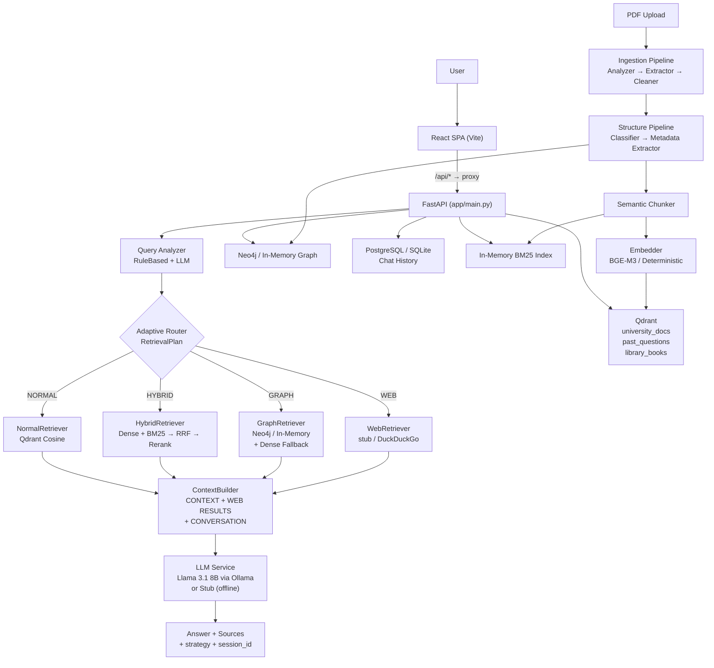

# University Academic Assistant

<p align="center">
  <strong>Adaptive RAG-based conversational assistant for university academics</strong><br/>
  <em>Syllabi &bull; Notices &bull; Past Papers &bull; Regulations &bull; Calendars &bull; Library Books</em>
</p>

<p align="center">
  
  
  
  
  
  
  
</p>

<p align="center">
  Retrieval-Augmented Generation with <strong>Llama 3.1 8B (Ollama)</strong> &bull; Hybrid Search (Dense + BM25 + RRF) &bull; Knowledge Graph (Neo4j) &bull; Adaptive Router &bull; Grounded Answers with Citations
</p>

---

## Table of Contents

- [Overview](#overview)
- [Key Features](#key-features)
- [System Architecture](#system-architecture)
- [Tech Stack](#tech-stack)
- [Project Structure](#project-structure)
- [Prerequisites](#prerequisites)
- [Quick Start](#quick-start)
  - [Option A — Local Development (Hermetic, No Services Required)](#option-a--local-development-hermetic-no-services-required)
  - [Option B — Full Stack with Docker](#option-b--full-stack-with-docker)
- [Backend Setup in Detail](#backend-setup-in-detail)
- [Frontend Setup in Detail](#frontend-setup-in-detail)
- [API Reference](#api-reference)
- [Document Ingestion & Indexing](#document-ingestion--indexing)
- [RAG Pipeline](#rag-pipeline)
- [Configuration](#configuration)
- [Evaluation & Performance](#evaluation--performance)
- [Deployment](#deployment)
- [Security](#security)
- [Testing](#testing)
- [Known Limitations](#known-limitations)
- [Roadmap](#roadmap)
- [Contributing](#contributing)

---

## Overview

**University Academic Assistant** is a production-grade, adaptive RAG platform that lets students and staff ask natural-language questions about university documents and receive **grounded, cited answers** — never hallucinations.

The system ingests PDFs (text-readable or scanned), classifies them into 6 document types, extracts structured metadata, chunks them semantically, indexes them into Qdrant (vectors) + an in-memory BM25 index (keywords) + Neo4j (knowledge graph), and routes every query through an **adaptive router** that selects the optimal retrieval strategy: `NORMAL` (dense), `HYBRID` (dense + BM25), `GRAPH` (knowledge graph), or `WEB` (external search).

All 13 planned phases are **complete**: ingestion, classification, chunking, vector search, hybrid fusion, knowledge graph, adaptive routing, book recommendation, chat history, web search, React integration, and evaluation / optimization / deployment hardening.

> **Design principle:** No hard-coded subjects or topics. No fabricated metadata. Every answer is traceable to a source page. If evidence is insufficient, the system says so explicitly.

---

## Key Features

| Capability | Description |
|---|---|
| **PDF Ingestion (Phase 2)** | Auto-detects text-readable vs. scanned PDFs; PyMuPDF for text extraction, Tesseract OCR for scanned pages; page-level provenance preserved |
| **Document Classification (Phase 3)** | 7-way classification: `syllabus`, `notice`, `past_question`, `rules_regulations`, `academic_calendar`, `library_book`, `unknown`; deterministic + optional LLM extractor with strict schema validation |
| **Semantic Chunking (Phase 4)** | Structure-aware chunking — topic headings stay with definitions; past-paper questions become isolated chunks; every chunk carries `document_id`, `page`, `section`, `topic`, `subtopic` |
| **Vector Search (Phase 4–5)** | Embeddings via dedicated model (BGE-M3 via Ollama, or deterministic fallback); 3 Qdrant collections routed by document type; `NormalRetriever` + `ContextBuilder` with grounding prompt |
| **Hybrid Retrieval (Phase 6)** | Dense (Qdrant cosine) + Sparse (in-memory Okapi BM25) fused with **Reciprocal Rank Fusion** (scale-independent) + rerank blending RRF score with dense similarity |
| **Knowledge Graph (Phase 7)** | `University → Program → Semester → Subject → Topic/Subtopic → PastQuestion` in Neo4j (or in-memory); deterministic extraction, schema-validated, traceable to source PDF |
| **Adaptive Router (Phase 8)** | Rule-based query analyzer + optional LLM classifier; structured `RetrievalPlan` `{strategy, reason, filters, graph_params, fallback}`; Graph RAG with dense fallback |
| **Book Recommendation (Phase 9)** | Syllabus-aware ranking: `score = 0.85·topic_coverage + 0.15·subtopic_coverage`; transparent `matched/missing_topics`; alias expansion (e.g. DBMS → Database Management System) |
| **Chat History (Phase 10)** | PostgreSQL-persisted sessions & messages; bounded conversation context (`HISTORY_MAX_MESSAGES` / `HISTORY_MAX_CHARS`) injected as `CONVERSATION:` block |
| **Web Search (Phase 11)** | Controlled external search (`stub` / `duckduckgo`); university-domain priority; mixed queries combine internal + web; URL-attributed `WEB RESULTS:` block |
| **React Frontend (Phase 12)** | Vite + React 18; conversation sidebar, source cards, recommendation cards, responsive drawer layout, friendly error banners, `/api` proxy + CORS |
| **Hardening (Phase 13)** | LRU embedding cache + TTL retrieval cache (invalidated on indexing); `X-Request-ID` structured logging; rate limiting (429); upload cap (413); prompt-injection guard |

---

## System Architecture



**Ingestion → Indexing flow (single `POST /documents/index` call):**

```
PDF → PDFAnalyzer (text vs scanned) → PyMuPDF / OCR → TextCleaner → NormalizedDocument
  → DocumentClassifier → MetadataExtractor → StructuredDocument
  → SemanticChunker → Embedder → Qdrant (3 collections) + BM25
  → GraphExtractor → Schema Validation → Neo4j / In-Memory
```

---

## Tech Stack

| Layer | Technology | Purpose |
|---|---|---|
| **Backend** | Python 3.12, FastAPI 0.115, Pydantic 2, SQLAlchemy 2 | API, config, ORM |
| **Vectors** | Qdrant 1.13 (COSINE), `qdrant-client` | Semantic search |
| **Keywords** | In-memory Okapi BM25 (`k1=1.5, b=0.75`) | Exact-token search |
| **Graph** | Neo4j 5.26 Community + `neo4j` driver (in-memory fallback) | Academic relationships |
| **Embeddings** | Ollama `bge-m3` / Deterministic token-hash fallback | Separate from chat LLM |
| **LLM** | Ollama `llama3.1:8b` / Stub (deterministic) | Grounded generation |
| **Database** | PostgreSQL 16 + `psycopg[binary]` (SQLite in-memory for dev/tests) | Chat sessions & messages |
| **PDF** | PyMuPDF 1.28, Pillow, pytesseract + Tesseract 5+ | Ingestion & OCR |
| **Frontend** | React 18, Vite 6, `@vitejs/plugin-react` | SPA chat interface |
| **Infra** | Docker, Docker Compose, Nginx 1.27 | Deployment |
| **Observability** | Structured logging, `X-Request-ID`, per-stage latencies | Monitoring |
| **Search** | DuckDuckGo HTML (live) / Stub (offline) | Web search |

---

## Project Structure

```
university-academic-assistant/
├── backend/
│   ├── app/
│   │   ├── api/              # HTTP routers (health, chat, documents, history, graph, web)
│   │   ├── config/           # Environment-based settings (pydantic-settings)
│   │   ├── core/             # Logging, rate limiting, request context
│   │   ├── models/           # SQLAlchemy ORM (ChatSession, ChatMessage)
│   │   ├── schemas/          # Pydantic request/response schemas
│   │   ├── services/         # Orchestration (ChatService, RecommendationService, ...)
│   │   ├── repositories/     # Data access (Qdrant, Neo4j, Postgres)
│   │   ├── ingestion/        # PDF analyzer, extractors, cleaner, pipeline
│   │   ├── structure/        # Classifier, metadata extractors, validation
│   │   ├── chunking/         # Structure-aware semantic chunker
│   │   ├── embedding/        # Embedder interface + backends (Ollama/deterministic)
│   │   ├── retrieval/        # NormalRetriever, BM25, HybridRetriever, GraphRetriever
│   │   ├── rag/              # ContextBuilder + grounding system prompt
│   │   ├── llm/              # LLM client interface + backends
│   │   ├── graph/            # Knowledge graph models, schema, extractor
│   │   ├── web/              # Web search provider interface + backends
│   │   ├── recommendation/   # TopicResolver, CoverageCalculator
│   │   ├── caching/          # EmbeddingCache (LRU), RetrievalCache (TTL)
│   │   └── evaluation/       # Hermetic eval corpus, metrics, harness
│   ├── scripts/              # CLI tools (ingest_pdf, sample_*, evaluate, profile)
│   ├── tests/                # pytest suite (316 tests, hermetic)
│   ├── requirements.txt
│   ├── Dockerfile
│   └── .env.example / .env.development / .env.test / .env.production
├── frontend/
│   ├── src/
│   │   ├── components/       # Sidebar, ChatInterface, MessageBubble, SourceCard, RecommendationCard
│   │   ├── services/         # apiClient, chatApi, recommendationApi
│   │   ├── utils/            # Formatting helpers
│   │   ├── App.jsx           # Session + message state, routing
│   │   └── main.jsx
│   ├── vite.config.js        # Dev proxy: /api/* → http://localhost:8000
│   ├── nginx.conf            # Production: /api/ → backend:8000
│   └── Dockerfile            # Multi-stage: node build → nginx serve
├── data/
│   ├── raw/                  # Uploaded PDFs
│   ├── processed/            # Extracted text / chunks
│   └── test/                 # Sample documents for testing
├── docs/
│   ├── architecture.md
│   ├── EVALUATION.md
│   ├── PERFORMANCE.md
│   ├── SECURITY.md
│   ├── DEPLOYMENT.md
│   └── E2E.md
├── docker-compose.yml
└── README.md
```

---

## Prerequisites

| Requirement | Version | Notes |
|---|---|---|
| **Python** | 3.12+ | Backend runtime |
| **Node.js** | 18+ | Frontend build & dev server |
| **Tesseract OCR** | 5+ | Required for scanned PDFs only |
| **Docker & Compose** | Latest | Optional — for full-stack deployment |

Install Tesseract:

```bash
# Windows
winget install UB-Mannheim.TesseractOCR

# Debian / Ubuntu
sudo apt install tesseract-ocr

# macOS
brew install tesseract
```

> The app boots with **zero external services** via hermetic backends (deterministic embeddings, stub LLM, in-memory Qdrant/BM25/graph/SQLite). External services (Qdrant server, Neo4j, Postgres, Ollama) are optional and only needed for production data.

---

## Quick Start

### Option A — Local Development (Hermetic, No Services Required)

Fastest path. No Docker, no model server, no database server.

**1. Backend**

```powershell
cd backend
python -m venv .venv
.\.venv\Scripts\Activate.ps1          # Windows
# source .venv/bin/activate           # Linux / macOS

pip install -r requirements.txt
pip install -r requirements-dev.txt   # for tests

Copy-Item .env.development .env        # or: cp .env.development .env  (Linux/macOS)

uvicorn app.main:app --reload         # http://localhost:8000
```

Verify:

```powershell
curl.exe http://localhost:8000/health          # {"status":"ok"}
# Interactive docs:
# http://localhost:8000/docs
```

**2. Frontend** (in a second terminal)

```powershell
cd frontend
npm install
npm run dev                           # http://localhost:5173
```

The Vite dev server proxies `/api/*` to `http://localhost:8000` automatically. Open **http://localhost:5173** — the chat UI is ready.

**3. Try a chat (no documents indexed yet):**

```powershell
curl.exe -X POST http://localhost:8000/chat `
  -H "Content-Type: application/json" `
  -d '{"message":"What is normalization?"}'
# With empty index → explicit "insufficient information" answer (no hallucination)
```

### Option B — Full Stack with Docker

Starts backend, frontend (Nginx), Qdrant, Neo4j, and PostgreSQL. Hermetic by default — no model server required.

```bash
docker compose up -d
# Frontend:  http://localhost:8080
# Backend:   http://localhost:8000
# Qdrant:    http://localhost:6333
# Neo4j:     http://localhost:7474  (bolt://localhost:7687)
```

**With local LLM (CPU-only Ollama, no GPU):**

```bash
docker compose --profile llm up -d
docker compose --profile llm exec ollama ollama pull llama3.1:8b
docker compose --profile llm exec ollama ollama pull bge-m3

# Recreate backend with real models:
LLM_BACKEND=ollama EMBEDDER_BACKEND=ollama docker compose up -d --force-recreate backend
```

Check status:

```bash
docker compose ps
curl http://localhost:8000/health
```

Stop:

```bash
docker compose down          # keep volumes
docker compose down -v       # also delete data
```

---

## Backend Setup in Detail

### Environment files

| File | Purpose |
|---|---|
| `.env.example` | Documented reference with all variables |
| `.env.development` | Hermetic local dev (stub LLM, deterministic embedder, SQLite) |
| `.env.test` | Hermetic test/eval config |
| `.env.production` | Production template — contains `CHANGE_ME` placeholders; **never commit** |

Copy the appropriate template to `.env` — `pydantic-settings` loads it automatically; environment variables always win.

### Key configuration (see `.env.example` for full list)

| Variable | Default | Description |
|---|---|---|
| `QDRANT_URL` | `http://localhost:6333` | Qdrant URL; use `:memory:` for embedded client |
| `GRAPH_BACKEND` | `memory` | `memory` / `neo4j` / `auto` |
| `DATABASE_BACKEND` | `memory` | `memory` (SQLite) / `postgres` / `auto` |
| `LLM_BACKEND` | `auto` | `auto` / `ollama` / `stub` |
| `EMBEDDER_BACKEND` | `auto` | `auto` / `ollama` / `deterministic` |
| `RAG_RETRIEVAL_STRATEGY` | `auto` | `auto` (router) / `normal` / `hybrid` |
| `ROUTER_CLASSIFIER` | `auto` | `rules` / `llm` / `auto` |
| `WEB_SEARCH_BACKEND` | `stub` | `stub` / `duckduckgo` |
| `CORS_ORIGINS` | `http://localhost:5173,...` | Allowed browser origins |

---

## Frontend Setup in Detail

```powershell
cd frontend
npm install          # install deps
npm run dev          # dev server on :5173, proxies /api/* → backend
npm run build        # production bundle → frontend/dist
npm run preview      # preview production build
```

| Env var | Default | Purpose |
|---|---|---|
| `VITE_BACKEND_URL` | `http://localhost:8000` | Dev proxy target |
| `VITE_API_BASE` | *(same-origin)* | Absolute backend URL for production build |

---

## API Reference

Interactive docs at **http://localhost:8000/docs** (Swagger) and **/redoc**.

| Method | Endpoint | Description |
|---|---|---|
| `GET` | `/health` | Liveness probe → `{"status":"ok"}` |
| `POST` | `/documents/upload` | Upload PDF → `NormalizedDocument` (ingestion only) |
| `POST` | `/documents/analyze` | Upload PDF → `StructuredDocument` (ingestion + classification + metadata) |
| `POST` | `/documents/index` | Upload PDF → full indexing (chunk → embed → Qdrant + BM25 + graph) |
| `GET` | `/search?q=...&top_k=5` | Vector search across all collections |
| `POST` | `/chat` | `{message, session_id?, top_k?}` → `{answer, sources, strategy, session_id}` |
| `POST` | `/router/plan` | `{message}` → `RetrievalPlan` without retrieving (debug routing) |
| `POST` | `/recommendations` | `{query}` → ranked books with `score`, `matched/missing_topics`, `explanation` |
| `POST` | `/web/search` | `{query}` → raw web search results (provider verification) |
| `GET` | `/chat/sessions` | List sessions (most recent first, with `message_count`) |
| `GET` | `/chat/sessions/{id}` | Session detail + all messages |
| `DELETE` | `/chat/sessions/{id}` | Delete session (cascades messages) → `204` |
| `GET` | `/history` | Session list (alias for `GET /chat/sessions`) |
| `GET` | `/graph/summary` | Graph status + entity counts |

**Example — chat:**

```powershell
curl.exe -X POST http://localhost:8000/chat `
  -H "Content-Type: application/json" `
  -d '{"message":"Explain normalization."}'

# Response:
# {
#   "answer": "Normalization reduces data redundancy ...",
#   "sources": [{ "text": "Unit 2: Normalization ...", "score": 0.54,
#                 "metadata": {"title":"DBMS Syllabus","page":1,"topic":"Normalization"}, "collection":"university_docs"}],
#   "strategy": "NORMAL",
#   "session_id": "776c..."}
```

---

## Document Ingestion & Indexing

**Single-call indexing:**

```powershell
curl.exe -X POST -F "file=@syllabus.pdf;type=application/pdf" http://localhost:8000/documents/index
```

**Step-by-step (inspect each stage):**

```powershell
# 1. Ingestion only
curl.exe -X POST -F "file=@syllabus.pdf;type=application/pdf" http://localhost:8000/documents/upload

# 2. Classification + metadata
curl.exe -X POST -F "file=@syllabus.pdf;type=application/pdf" http://localhost:8000/documents/analyze

# 3. CLI (prints NormalizedDocument as JSON)
cd backend
python scripts/ingest_pdf.py path/to/document.pdf              # full JSON
python scripts/ingest_pdf.py path/to/document.pdf --summary    # summary
python scripts/ingest_pdf.py path/to/document.pdf --analyze   # + classification
python scripts/ingest_pdf.py path/to/document.pdf --index     # + index + sample search
```

**Offline demos (no services required):**

```powershell
cd backend
python scripts/sample_search.py          # index samples + searches
python scripts/sample_chat.py            # full RAG slice
python scripts/sample_hybrid.py          # dense vs hybrid comparison
python scripts/sample_graph.py           # knowledge graph summary + queries
python scripts/sample_recommendation.py  # book recommendation
```

---

## RAG Pipeline

### Normal RAG

```
Query → NormalRetriever (embed → Qdrant top-K) → ContextBuilder → LLM → Answer + Sources
```

### Hybrid RAG (default when `RAG_RETRIEVAL_STRATEGY=hybrid` or via router)

```
Query → Dense (Qdrant cosine) ─┐
      → Sparse (BM25)        ──┤→ RRF (1/(k+rank)) → Rerank (0.7·RRF + 0.3·dense) → Top-K
```

Why RRF? Dense cosine and BM25 scores are on **incompatible scales** — summing them raw is meaningless. RRF is rank-based and scale-independent.

### Adaptive Router (default: `RAG_RETRIEVAL_STRATEGY=auto`)

```
Query → RuleBasedQueryAnalyzer → RetrievalPlan {strategy, reason, filters, graph_params}
      → NORMAL | HYBRID | GRAPH | WEB → Retrieval → ContextBuilder → LLM
```

- **HYBRID** — exact tokens: regulation numbers, subject codes (`CSIT 325`), dates, years, question numbers, marks
- **GRAPH** — structural: *subjects in semester 5*, *topics of DBMS*, *past questions about normalization*
- **WEB** — current/external signals: *latest*, *current*, *news*, *pricing*, *today* (university priority preserved; mixed queries combine both)
- **NORMAL** — everything else (semantic / conceptual)

Inspect routing without retrieving: `POST /router/plan`.

### Book Recommendation

```
Query → TopicResolver (syllabus evidence via cosine or shared token + alias expansion)
      → required topics (chunk topics ∪ graph topics)
      → book profiles (distinct chapter topics/subtopics from index)
      → CoverageCalculator: score = 0.85·topic_cov + 0.15·subtopic_cov → ranked books
```

---

## Configuration

All settings are environment-driven (`backend/.env.example` is the complete reference). Defaults allow the app to boot with **no external services**.

<details>
<summary>Full configuration table</summary>

| Variable | Default | Description |
|---|---|---|
| `APP_NAME` | `University Academic Assistant` | App display name |
| `DEBUG` | `false` | Verbose error responses |
| `LOG_LEVEL` / `LOG_FORMAT` | `INFO` / `text` | `text` or `json` |
| `API_HOST` / `API_PORT` | `0.0.0.0` / `8000` | Bind address |
| `CORS_ORIGINS` | `http://localhost:5173,...` | Allowed browser origins |
| `DATABASE_BACKEND` / `DATABASE_URL` | `memory` / `postgresql+...` | Chat history store |
| `HISTORY_MAX_CHARS` / `HISTORY_MAX_MESSAGES` | `2000` / `12` | Bounded conversation window |
| `QDRANT_URL` / `QDRANT_API_KEY` | `http://localhost:6333` / `""` | Vector store |
| `GRAPH_BACKEND` / `NEO4J_URI` | `memory` / `bolt://...` | Knowledge graph |
| `OLLAMA_BASE_URL` / `OLLAMA_MODEL` | `http://localhost:11434` / `llama3.1:8b` | LLM server |
| `LLM_BACKEND` / `LLM_TEMPERATURE` / `LLM_TIMEOUT` | `auto` / `0.2` / `120` | Generation |
| `EMBEDDER_BACKEND` / `EMBEDDING_MODEL` / `EMBEDDING_DIMENSIONS` | `auto` / `bge-m3` / `384` | Embeddings |
| `RAG_TOP_K` / `CONTEXT_MAX_CHARS` / `CONTEXT_MAX_SOURCES` / `RAG_MIN_SCORE` | `5` / `4000` / `8` / `0.0` | RAG grounding |
| `RAG_RETRIEVAL_STRATEGY` / `ROUTER_CLASSIFIER` / `ROUTER_FALLBACK_STRATEGY` | `auto` / `auto` / `hybrid` | Routing |
| `HYBRID_RRF_K` / `HYBRID_RERANK_*_WEIGHT` / `HYBRID_POOL_FACTOR` | `60` / `0.7, 0.3` / `2` | Hybrid fusion |
| `RECOMMENDATION_SEMANTIC_THRESHOLD` / `RECOMMENDATION_*_WEIGHT` | `0.4` / `0.85, 0.15` | Recommendations |
| `WEB_SEARCH_BACKEND` / `WEB_SEARCH_TIMEOUT` / `WEB_MAX_SOURCES` | `stub` / `8` / `4` | Web search |
| `EMBEDDING_CACHE_MAX_ENTRIES` / `RETRIEVAL_CACHE_*` | `5000` / `256, 300s` | Caching |
| `MAX_UPLOAD_BYTES` | `20 MB` | Upload cap |
| `RATE_LIMIT_ENABLED` / `RATE_LIMIT_PER_MINUTE` | `true` / `120` | Rate limiting |
| `TESSERACT_PATH` / `OCR_LANGUAGE` / `OCR_DPI` | `""` / `eng` / `300` | OCR |
| `CHUNK_MAX_CHARS` / `CHUNK_OVERLAP_CHARS` | `1200` / `150` | Chunking |
| `DOCUMENT_CLASSIFIER_MIN_SCORE` | `3` | Classification threshold |

</details>

---

## Evaluation & Performance

All evaluations are **hermetic** (deterministic embedder, stub LLM, in-memory backends) — reproducible on any machine without external services.

**Run the full evaluation:**

```powershell
cd backend
$env:QDRANT_URL=":memory:"; $env:EMBEDDER_BACKEND="deterministic"
$env:LLM_BACKEND="stub"; $env:ROUTER_CLASSIFIER="rules"
$env:GRAPH_BACKEND="memory"; $env:DATABASE_BACKEND="memory"
python scripts/evaluate.py
```

**Profile per-query latencies:**

```powershell
python scripts/profile_performance.py   # see docs/PERFORMANCE.md
```

| Evaluation | Metric | Result |
|---|---|---|
| **Router** (36 queries) | Accuracy / False-routing / Fallback | **100% / 0% / 0%** |
| **Retrieval** (per-strategy) | HYBRID Recall@1 = 1.00, GRAPH MRR = 1.00 | Hybrid best for exact-token queries |
| **Answer** (grounded stub) | Faithfulness / Hallucination | **100% / 0%** |
| **Recommendation** | 9/9 checks pass | Coverage formula verified |

See [`docs/EVALUATION.md`](docs/EVALUATION.md) and [`docs/PERFORMANCE.md`](docs/PERFORMANCE.md) for methodology and full tables. Three real defects were found and fixed via the eval harness — documented in `EVALUATION.md`.

---

## Deployment

See [`docs/DEPLOYMENT.md`](docs/DEPLOYMENT.md) for the complete guide.

**Production checklist:**

1. Override `NEO4J_PASSWORD` and `POSTGRES_PASSWORD` (never use defaults)
2. Set `CORS_ORIGINS` to your real frontend origin
3. Restrict published ports of Qdrant/Neo4j/Postgres to `127.0.0.1` or remove them
4. Terminate TLS at the public entry point (Nginx / load balancer)
5. Set `LOG_FORMAT=json` and ship stdout to a log aggregator
6. Review [`docs/SECURITY.md`](docs/SECURITY.md) for hardening details

```bash
# Production example
export NEO4J_PASSWORD="$(openssl rand -base64 24)"
export POSTGRES_PASSWORD="$(openssl rand -base64 24)"
docker compose up -d
```

---

## Security

Detailed in [`docs/SECURITY.md`](docs/SECURITY.md):

- **No hard-coded secrets** — all credentials from environment / `.env` (git-ignored)
- **Request correlation** — every response carries `X-Request-ID`; all log lines share it
- **Log scrubbing** — fields containing `password`, `api_key`, `secret`, `token` are redacted; user messages and document contents are **never logged**
- **Prompt-injection guard** — system prompt treats retrieved context, web results, and conversation history as **data, not instructions**
- **Rate limiting** — per-IP sliding window (`RATE_LIMIT_PER_MINUTE`, default 120 → `429` + `Retry-After`; `/health` exempt)
- **Upload limits** — `MAX_UPLOAD_BYTES` (default 20 MB) enforced while streaming → `413`; non-PDF → `415`
- **Caches & graph are process-local** — single uvicorn worker by design; scale horizontally behind a shared limiter/cache

---

## Testing

```powershell
cd backend
pytest -q                          # all 316 tests, hermetic (no services)
pytest tests/test_hybrid_retriever.py -q
pytest tests/test_graph.py -q
pytest tests/test_security.py -q
pytest --cov=app --cov-report=term-missing
```

The suite covers: health/config, PDF ingestion, OCR (mocked + Tesseract E2E), classification, metadata extraction, chunking, embeddings, Qdrant indexing, Normal/Hybrid/Graph retrieval, router, recommendations, chat history, web search, caching, and security — all hermetic.

---

## Known Limitations

- `GET /documents` returns `501` — document listing is pending
- `deterministic` embedder is for tests/offline only; production quality requires a real model (`bge-m3`)
- BM25 and in-memory graph are per-process (rebuilt on restart); not persisted across restarts
- Chat history is anonymous (no auth); `memory` backend is ephemeral
- Web `stub` returns canned results; live `duckduckgo` uses the public HTML endpoint (may be rate-limited)
- Frontend has no automated browser tests (guarded by backend suite + production build)
- Caches and rate limiter are process-local (single-worker design)

---

## Roadmap

| Phase | Scope | Status |
|---|---|---|
| 1 | Project foundation & architecture | Complete |
| 2 | PDF ingestion & OCR | Complete |
| 3 | Document classification & metadata extraction | Complete |
| 4 | Chunking, embeddings & Qdrant | Complete |
| 5 | Basic Normal RAG (`POST /chat`) | Complete |
| 6 | Hybrid RAG (BM25 + RRF) | Complete |
| 7 | Neo4j academic knowledge graph | Complete |
| 8 | Query analyzer & adaptive router (Graph RAG) | Complete |
| 9 | Syllabus-aware book recommendation | Complete |
| 10 | PostgreSQL chat history | Complete |
| 11 | Controlled web search | Complete |
| 12 | React + FastAPI integration | Complete |
| 13 | Evaluation, optimization & deployment | Complete |

---

## Contributing

1. Fork and create a feature branch
2. Follow the existing module boundaries in [`docs/architecture.md`](docs/architecture.md)
3. Keep the test suite hermetic — no external service required for `pytest`
4. Run `pytest -q` and `python scripts/evaluate.py` before submitting
5. Open a PR with a clear description of the change and its test coverage

---

<p align="center">
  Built with FastAPI, Qdrant, Neo4j, Ollama, and React.<br/>
  <sub>University Academic Assistant — grounded answers, always cited, never hallucinated.</sub>
</p>
